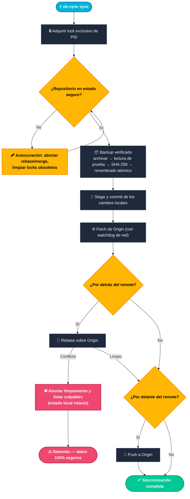

[English](README.md) | [فارسی](README.fa.md) | [Español](README.es.md)

<div id="readme-top" align="center">


**⚡ Sincronización de Obsidian ↔ GitHub de nivel empresarial — desde tu teléfono, tu portátil, tu lo-que-sea.**

*Un solo script. Tres plataformas. Cero dependencias extra. Nueve capas de defensa.*


[](CHANGELOG.md)
[](LICENSE)
[](#-inicio-rápido)
[](https://www.gnu.org/software/bash/)
[](https://github.com/CheginiSoroush/obsidian-sync-scripts/actions/workflows/lint.yml)

<p align="center">
  <a href="#-inicio-rápido">🚀 Inicio rápido</a> •
  <a href="#-el-menú-interactivo">📱 TUI interactiva</a> •
  <a href="#️-referencia-de-comandos">⌨️ Referencia CLI</a> •
  <a href="#️-las-9-capas-de-defensa">🛡️ Defensa de 9 capas</a> •
  <a href="#-manual-de-recuperación-ante-desastres">🚑 Manual de recuperación</a> •
  <a href="#-preguntas-frecuentes">❓ FAQ</a>
</p>

<p align="center">
  <a href="https://github.com/CheginiSoroush/obsidian-sync-scripts/stargazers"></a>
  <a href="https://github.com/CheginiSoroush/obsidian-sync-scripts/issues"></a>
  <a href="CONTRIBUTING.md"></a>
  <a href="https://cheginisoroush.github.io/obsidian-sync-scripts/"></a>
</p>

<p align="center">
  
</p>

<p align="center"><b>▲ Salida real, animada.</b> Una ejecución genuina capturada de <b>ob-sync sync</b> — no es una maqueta.</p>

---

*«Tus notas merecen algo mejor que esperar que el sync funcione.»*

<details>
<summary>Puristas del ASCII — el logo original vive aquí</summary>

<pre>
 ██████╗  ██████╗           ███████╗ ██╗   ██╗ ███╗   ██╗  ██████╗
██╔═══██╗ ██╔══██╗          ██╔════╝ ╚██╗ ██╔╝ ████╗  ██║ ██╔════╝
██║   ██║ ██████╔╝ ███████╗ ███████╗  ╚████╔╝  ██╔██╗ ██║ ██║
██║   ██║ ██╔══██╗ ╚══════╝ ╚════██║   ╚██╔╝   ██║╚██╗██║ ██║
╚██████╔╝ ██████╔╝          ███████║    ██║    ██║ ╚████║ ╚██████╗
 ╚═════╝  ╚═════╝           ╚══════╝    ╚═╝    ╚═╝  ╚═══╝  ╚═════╝
</pre>

</details>

</div>

<p align="center">
  
</p>

<br>

## 🔥 El problema

Tomas notas en tu teléfono y en tu portátil. Las versionas con Git.
Entre esos dos hechos se abre un infierno: redes móviles que mueren a mitad de un push, Android matando procesos en segundo plano cuando le apetece, almacenamiento compartido sin bits `exec` — y a un solo `git pull` interrumpido de perder una semana de ideas.

La mayoría se rinde y reza. **Tú no tienes por qué.**

**`ob-sync`** es un único script de Bash autocontenido que convierte tu terminal en un motor de sincronización curtido en batalla para tu vault de Obsidian — diseñado específicamente para el entorno hostil del almacenamiento compartido de Android, e igual de a gusto en Linux y macOS.

| 💀 Sin `ob-sync` | 🛡️ Con `ob-sync` |
| :--- | :--- |
| Un `git pull` interrumpido deja tu vault en el limbo del rebase | **Git autocurativo** aborta los estados rotos y limpia los locks obsoletos automáticamente |
| La red se corta a mitad de un push y deja la terminal colgada para siempre | Los **watchdogs** imponen timeouts estrictos a cada llamada remota *y* a cada operación local masiva |
| Una carpeta `.git` corrupta significa cirugía manual o notas perdidas | La **reparación en dos fases** reconstruye los metadatos de forma atómica conservando los archivos locales |
| Ninguna red de seguridad antes de operaciones Git destructivas | Los **backups verificados con SHA-256** se ejecutan antes de que *cualquier* mutación toque tu vault |

> [!IMPORTANT]
> **Filosofía central:** *Ni archivos a medias. Ni pérdida silenciosa de datos. Ni errores crípticos. Nunca.*

---

## 🚀 Inicio rápido

### 📱 Android (Termux)

```bash
pkg install curl
curl -fsSL https://raw.githubusercontent.com/CheginiSoroush/obsidian-sync-scripts/main/mobile/install.sh | bash

ob-sync doctor     # 1. Verify the environment
ob-sync init       # 2. Clone or adopt your vault (asks for your GitHub repo URL)
ob-sync            # 3. Open the interactive menu
```

### 🖥️ Linux y macOS

```bash
git clone https://github.com/CheginiSoroush/obsidian-sync-scripts.git
cd obsidian-sync-scripts
./desktop/install.sh

ob-sync init && ob-sync sync   # init asks for your GitHub repo URL
```

> [!WARNING]
> Conectar los instaladores a `bash` con una tubería es cómodo pero ciego. Si prefieres inspeccionar antes de ejecutar, revisa primero [`mobile/install.sh`](mobile/install.sh) o [`desktop/install.sh`](desktop/install.sh), o usa el método `git clone` de arriba.

### ✨ Cómo se ve una sincronización exitosa

▶️ **[Mira la ejecución real animada](#readme-top)** — una sesión genuina capturada se reproduce en la parte superior de esta página. Salida exacta abajo:

```text
$ ob-sync sync

  Full Synchronization
  ────────────────────────────────────────────────────────
  [1] Checking repository state
  [ OK ] Repository is in a safe state
  [2] Creating pre-sync backup
  [ OK ] Backup: pre-sync-20250612-143207.tar.gz
  [3] Committing local changes
  [ OK ] Committed 3 changed file(s)
  [4] Fetching remote state
  [5] Rebasing onto origin/main (2 remote commit(s))
  [ OK ] Integrated 2 remote commit(s)
  [6] Pushing to origin/main
  [ OK ] Pushed 1 commit(s)

  [ OK ] Sync complete — 2 commit(s) in, 1 commit(s) out
```

---

## 📱 El menú interactivo

Ejecuta `ob-sync` sin argumentos. En un teclado de teléfono, teclear subcomandos es fricción — **este menú es la clave de todo:**

<p align="center">
  
</p>

<details>
<summary>El mismo menú en texto plano</summary>

```text
$ ob-sync

  ──────────────────────────────────────────
     OBSIDIAN SYNC TOOL  ·  v9.3.0
  ──────────────────────────────────────────

  Vault:   /storage/emulated/0/Documents/Obsidian
  Branch:  main
  Changes: 3
  Last:    2025-06-12 14:32:07

  MENU
  ------------------------------------------

  1) Sync      backup + rebase + push
  2) Pull      integrate remote changes
  3) Push      publish local changes
  4) Backup    create a verified backup
  5) Restore   roll back from a backup
  6) Verify    check backup integrity
  7) Repair    rebuild git metadata
  8) Organize  audit notes & attachments
  9) Status    vault overview
  10) Health   git integrity check
  11) Doctor   diagnose environment
  12) Quick    backup + sync, one shot
  13) Diff      pending changes
  14) Config    effective settings
  15) Remote    show or set the remote
  16) Cron      schedule automatic syncs
  17) EditConf  edit the config file
  18) Init      new vault / first-time setup
  0) Exit     quit the tool

  ------------------------------------------

  Select an option [0-18]:
```

</details>

> [!TIP]
> **A prueba de errores por diseño:** las operaciones nunca matan tu sesión interactiva, y el lock de PID se libera limpiamente entre acciones — pulsa `1` cinco veces seguidas si te apetece.

---

## 🧠 Cómo funciona

<p align="center">
  
</p>

Cada ejecución de `ob-sync sync` recorre la misma máquina de estados determinista y tolerante a fallos — aquí la tienes, paso a paso:



---

## 🛡️ Las 9 capas de defensa

Entre tú y la pérdida de datos se alzan nueve muros independientes — y el primero de todos es un backup con marca de tiempo y checksum tomado antes de que pase *cualquier otra cosa*.

<p align="center">
  
</p>

| Capa | Mecanismo | Qué garantiza |
| :---: | :--- | :--- |
| **01** | **Lock de PID** | Dos instancias nunca pueden tocar el vault a la vez; los PIDs muertos se reclaman automáticamente. |
| **02** | **Backups verificados** | Un backup solo cuenta si el stream completo se relee limpiamente *y* su checksum SHA-256 queda registrado. |
| **03** | **Publicación atómica** | Los backups escriben en archivos `.part` y renombran de forma atómica — un crash nunca deja un archivo escrito a medias. |
| **04** | **Watchdogs** | Cada llamada Git remota (watchdog de red) y cada operación local masiva — archivado, hash, `fsck` (watchdog local) — se ejecuta bajo un timeout configurable, así que ni una conexión colgada ni un montaje muerto pueden congelar tu vault. |
| **05** | **Git autocurativo** | Los rebase interrumpidos, los merge sin terminar y los archivos `.lock` obsoletos se recuperan automáticamente. |
| **06** | **Reparación en dos fases** | El `.git` de reemplazo se clona, se verifica con `fsck` y se deja en staging *antes* de mover nada — con rollback instantáneo. |
| **07** | **Guardián contra tar-slip** | `restore` audita cada miembro del archivo antes de la extracción — se rechazan rutas absolutas, traversal con `..` y symlinks. |
| **08** | **Registro de temporales** | Cada archivo temporal de ejecución se rastrea y se barre en *cualquier* ruta de salida — incluido `Ctrl+C`; los artefactos que filtre un `SIGKILL` inatrapable se reclaman en la siguiente ejecución. |
| **09** | **Restore solo aditivo** | Los archivos remotos solo se *añaden* si faltan durante la recuperación; tus ediciones locales siempre ganan. |

---

## ⌨️ Referencia de comandos

### 🔄 Sincronización y flujo de trabajo

| Comando | Descripción |
| :--- | :--- |
| `ob-sync` | Abre el **menú interactivo** (o ejecuta una sincronización completa cuando se invoca de forma no interactiva / vía cron) |
| `ob-sync sync` | Pipeline completo: `check` → `backup` → `commit` → `fetch` → `rebase` → `push` · añade `--json` para un resultado legible por máquina (ver [Operaciones legibles por máquina](#operaciones-legibles-por-máquina)) |
| `ob-sync quick` | Crea un backup verificado + ejecuta la sincronización completa de un tirón · admite `--json` |
| `ob-sync pull` | Hace commit de los cambios locales y luego integra los commits remotos · admite `--json` |
| `ob-sync push` | Hace commit de los cambios locales y luego publica al remote · admite `--json` |
| `ob-sync cron [sub]` | Programa sincronizaciones automáticas en tu crontab: `status` (por defecto), `install <schedule> [HH:MM]`, `show`, `uninstall` — ver [Sincronizaciones programadas](#-automatización) |

### 📦 Backup, restore y reparación

| Comando | Descripción |
| :--- | :--- |
| `ob-sync backup` | Crea y verifica con SHA-256 un archivo de backup completo del vault · añade `--json` para un resultado legible por máquina (ver [Backups legibles por máquina](#backups-legibles-por-máquina)) |
| `ob-sync restore [--list \|--dry-run \|--json] [target]` | Vuelve atrás desde un backup auditado (`latest`, nombre de archivo o ruta) · `--list` previsualiza el contenido y el checksum · `--dry-run` ensaya el restore completo sin cambiar nada · `--list --json` emite una previsualización/inventario legible por máquina · `--json <target> -y` devuelve un resultado de restore legible por máquina para simulacros de DR guionizados (ver [Backups legibles por máquina](#backups-legibles-por-máquina)) |
| `ob-sync verify [--json]` | Audita la integridad criptográfica de **todos** los backups almacenados — `--json` reporta un array de resultados por archivo (ver [Backups legibles por máquina](#backups-legibles-por-máquina)) |
| `ob-sync repair` | Reconstruye atómicamente los metadatos `.git` desde el remote conservando todos los archivos locales |
| `ob-sync remote [url]` | Muestra la URL del remote — o fija una nueva, persistida también para las shells de cron |

### 🩺 Diagnóstico e higiene del vault

| Comando | Descripción |
| :--- | :--- |
| `ob-sync organize [--fix]` | Audita notas vacías, archivos grandes y adjuntos huérfanos (`--fix` reubica a los huérfanos) · añade `--json` para un informe de auditoría legible por máquina — `--fix --json` devuelve el informe de archivos movidos (ver [Todo legible por máquina](#todo-legible-por-máquina)) |
| `ob-sync diff` | Muestra los cambios pendientes del working tree con etiquetas humanas y un diff stat (solo lectura) |
| `ob-sync history [n]` | Lista los últimos `n` commits del vault con fechas relativas (solo lectura) · añade `--json` para un documento de commits legible por máquina (ver [Todo legible por máquina](#todo-legible-por-máquina)) |
| `ob-sync config` | Muestra la configuración efectiva y de dónde sale cada valor (solo lectura) |
| `ob-sync doctor [--json]` | Diagnostica compatibilidad de plataforma, herramientas requeridas, permisos de almacenamiento, remote y watchdog — avisa cuando los backups comparten sistema de archivos con el vault · `--json` emite un informe de comprobaciones legible por máquina (ver [Diagnóstico legible por máquina](#diagnóstico-legible-por-máquina)) |
| `ob-sync status [--json]` | Muestra una vista limpia de la rama del vault, los cambios pendientes y el estado de sincronización — `--json` emite salida legible por máquina para scripts y dashboards |
| `ob-sync health [--json]` | Ejecuta un `git fsck` profundo y una comprobación de integridad del repositorio — `--json` emite un informe de comprobaciones por fase y estadísticas (ver [Diagnóstico legible por máquina](#diagnóstico-legible-por-máquina)) |
| `ob-sync init` | Configuración interactiva de primer uso para clonar un vault remoto o adoptar una carpeta existente |
| `ob-sync log [n]` | Muestra la actividad reciente de sync y de commits (por defecto, las últimas `n` entradas) · añade `--json` para un documento de actividad legible por máquina |
| `ob-sync edit-conf` | Abre el archivo de configuración por máquina en `$EDITOR` (crea una plantilla inicial comentada en el primer uso) |

**Flags globales y códigos de salida:**

* **Flags:** `-y, --yes` (autoconfirmar) · `-n, --no-color` (salida plana) · `-h, --help` · `-v, --version`
* **Códigos de salida:** `0` éxito · `1` fallo operativo · `2` contención de lock (otra instancia está en ejecución)

---

## ⚙️ Configuración

No se necesita ninguna variable de entorno — `ob-sync init` escribe tus elecciones en la configuración por máquina. Todo sigue siendo sobrescribible:

| Variable | Valor por defecto | Descripción |
| :--- | :--- | :--- |
| `OBS_VAULT` | `~/storage/shared/Documents/Obsidian` *(Termux)*<br>`~/Documents/Obsidian` *(escritorio)* | Ruta de tu vault de Obsidian |
| `OBS_CONFIG` | `~/.config/ob-sync/config` | Config persistente por máquina que guarda `VAULT`, `REMOTE` y `BRANCH` (escrito por `init` / `remote`); resolución: `OBS_VAULT` > config > detección automática |
| `OBS_REMOTE` | *(sin definir — lo pregunta `init`, configurable con `remote <url>`)* | URL del repositorio remoto de Git |
| `OBS_BRANCH` | `main` | Rama de Git rastreada |
| `OBS_BACKUP_DIR` | `~/obsidian-backups` | Directorio donde se guardan los backups `.tar.gz` y sus checksums |
| `OBS_KEEP_BACKUPS` | `10` | Número de backups rotativos a conservar (`0` = conservar todo) |
| `OBS_LOG` | `~/ob-sync.log` | Ruta del archivo de log (pon `""` para desactivar el logging) |
| `OBS_GIT_TIMEOUT` | `120` | Timeout del watchdog de red en segundos (`0` lo desactiva) |
| `OBS_LOCAL_TIMEOUT` | `600` | Timeout del watchdog local en segundos para archivos tar, hashing y `fsck` (`0` lo desactiva) |
| `OBS_CRON_LOG` | `~/ob-sync-cron.log` | Archivo de salida para las ejecuciones iniciadas por `ob-sync cron install` |
| `OBS_SKIP_BACKUP` | `0` | Ponlo a `1` para saltarte el backup de seguridad previo al sync |
| `OBS_ATTACH_DIR` | `Attachments` | Carpeta de destino al ejecutar `ob-sync organize --fix` |

**Ejemplo — sincronización desatendida rápida:**

```bash
OBS_SKIP_BACKUP=1 OBS_GIT_TIMEOUT=300 ob-sync sync
```

---

## 🚑 Manual de recuperación ante desastres

Cuando todo se tuerce, no entres en pánico — ejecuta el comando correspondiente:

| Síntoma / escenario | Comando a ejecutar | Qué ocurre |
| :--- | :--- | :--- |
| *"Repository not in a safe state"* | `ob-sync sync` | Autocura rebase/merge interrumpidos y limpia los locks muertos |
| El sync falla misteriosamente una y otra vez | `ob-sync health` | Ejecuta un diagnóstico profundo de los objetos y el índice de Git |
| El directorio `.git` está corrupto | `ob-sync repair` | Reclona `.git` en staging, lo verifica y lo cambia de forma segura |
| *«Quiero mis notas de esta mañana»* | `ob-sync restore latest` | Verifica el checksum y la seguridad contra tar-slip, y luego restaura tu snapshot más reciente |
| *«¿Qué hay dentro de ese backup?»* | `ob-sync restore --list latest` | Verifica el archivo, audita cada miembro y muestra tamaños, número de notas y la estructura de primer nivel — sin extraer |
| Sospechas de un backup dañado | `ob-sync verify` | Prueba la descompresión del stream y los hashes SHA-256 de todos los backups |
| Algo huele raro en el entorno | `ob-sync doctor` | Comprueba la versión de Bash, coreutils, permisos de almacenamiento y la autenticación SSH/PAT |
| **Catástrofe total** | `tar -xzf <backup>.tar.gz` | Los backups son archivos `.tar.gz` estándar — extráelos en cualquier parte, en cualquier momento |

📖 **¿Necesitas un diagnóstico más a fondo?** Consulta la [Guía de solución de problemas](docs/TROUBLESHOOTING.md) completa.

---

## 🤖 Automatización

Los códigos de salida son estrictos, documentados y estables. Cuando se invoca de forma no interactiva (sin TTY), el `ob-sync` plano **pasa automáticamente a una sincronización completa** — suéltalo en cualquier planificador y simplemente funciona.

### Sincronizaciones programadas (`cron`)

Activa la sincronización automática con un solo comando — sin editar crontabs a mano:

```bash
ob-sync cron install hourly               # presets: 15min · 30min · hourly · daily [HH:MM]
ob-sync cron install daily 09:30          # every morning at 09:30
ob-sync cron install "*/5 9-18 * * 1-5"   # or any raw 5-field cron expression
ob-sync cron status                       # show the scheduled job
ob-sync cron uninstall                    # remove it (asks; add -y in scripts)
```

`cron install` escribe un **bloque delimitado por marcadores** en tu crontab de usuario — si lo instalas de nuevo se actualiza in situ, y el resto de tus entradas cron jamás se tocan. El job fija la ruta absoluta de `ob-sync` y tu `PATH` actual (un entorno de cron no hereda ninguno de los dos), añade la salida a `~/ob-sync-cron.log` para depurar, y avisa de antemano si todavía no hay remote ni vault configurados.

> [!TIP]
> **Termux necesita primero un daemon de cron:** `pkg install cronie termux-services && sv-enable crond`.

<details>
<summary>¿Prefieres un crontab escrito a mano?</summary>

Eso también funciona — el `ob-sync` plano detecta las shells no interactivas y ejecuta una sincronización completa:

```bash
*/30 * * * * ob-sync sync >> ~/ob-sync-cron.log 2>&1
```

</details>

### Todo legible por máquina

La superficie de máquina de un vistazo — **catorce documentos en trece comandos**. Cada comando `--json` garantiza las mismas tres cosas: el documento es lo **único** que sale por stdout, los diagnósticos humanos van a stderr, y el código de salida siempre coincide con el del comando humano:

| Comando | Puntos destacados del documento | Contrato de fallo |
| :--- | :--- | :--- |
| `status --json` | platform, vault, git, backups, watchdogs, cron, config, `last_sync` | nunca falla (rc 0) |
| `sync --json` · `pull --json` · `push --json` · `quick --json` | una única forma compartida: result, branch, remote, pulled/pushed/committed/conflicts, backup, elapsed | `{ "result": "error", "error": { "code", "message" } }`, rc 1 |
| `backup --json` | nombre del backup, ruta, tamaño exacto, estado del sidecar | `backup: null` + error, rc 1 |
| `restore --list --json` | inventario de todo el directorio o previsualización por archivo | `{ "error": … }`, rc 1 |
| `restore --json <target> -y` | resultado del apply: archive, `safety_backup`, `previous_vault`, elapsed | código de error estable, rc 1; rc 2 cuando el lock está ocupado |
| `verify --json` | filas por archivo + `total` / `passed` / `failed` | `verification_failed`, rc 1 |
| `health --json` | siete filas de comprobaciones + bloque statistics | `health_issues` / `health_failed`, rc 1 |
| `doctor --json` | array de comprobaciones (`ok`/`warn`/`fail`/`info`) | `result: "error"` cuando alguna comprobación falla, rc 1 |
| `log --json [n]` | `entries[{timestamp, source, message}]` | `log_unreadable` rc 1; un log ausente es un dato vacío válido, rc 0 |
| `history --json [n]` | `commits[{hash, date, author, subject}]` — SHA-1 completo, fechas ISO 8601 | `history_unreadable` rc 1; un repo recién creado es un dato vacío válido, rc 0 |
| `organize --json [--fix]` | auditoría del vault: contadores del scan, sin título/vacías/oversized (bytes exactos), huérfanos; con `--fix`: `moved[{from, to}]`, `skipped[{file, reason}]` | `scan_failed` / `attach_dir_create_failed` rc 1; el scan nunca toma el lock, fix responde `lock_busy` rc 2 |

La tabla completa de códigos de error (con primeros auxilios para cada uno) vive en la [Guía de solución de problemas](docs/TROUBLESHOOTING.md#machine-readable-modes---json).

`log --json` convierte el propio log de actividad de ob-sync en datos — una fila por entrada con `timestamp`, `source` (la función que lo emite) y `message`, de modo que la automatización puede vigilar una flota de crons con `jq` en vez de parsear texto libre. Un archivo de log ausente o desactivado es un dato vacío válido (`log_file: null`, rc 0); el rc 1 queda reservado para un archivo que existe pero es ilegible:

```console
$ ob-sync log --json 3
{
  "version": "9.3.0",
  "command": "log",
  "log_file": "~/ob-sync.log",
  "requested": 3,
  "count": 3,
  "entries": [
    { "timestamp": "2025-06-12 14:32:07", "source": "main", "message": "invoked: sync" },
    { "timestamp": "2025-06-12 14:32:08", "source": "make_backup", "message": "Backup created: pre-sync-20250612-143208.tar.gz (tar rc=0)" },
    { "timestamp": "2025-06-12 14:32:10", "source": "sync_run", "message": "Sync OK — pulled=2 pushed=1" }
  ],
  "error": null
}

$ ob-sync log --json 50 | jq -r '.entries[] | select(.message | test("ERROR")) | .timestamp'   # recent failures
```

`history --json` convierte el historial de commits del vault en datos — una fila por commit con el **hash SHA-1 completo** (sin ambigüedad; acórtalo con `jq` si quieres), una **fecha estricta ISO 8601** (estable y ordenable, a diferencia del relativo «2 hours ago» de la vista humana), el autor y el asunto. Un repositorio recién creado y sin commits todavía es un dato vacío válido (`count: 0`, rc 0); el rc 1 queda reservado para un repositorio que no se puede leer en absoluto:

```console
$ ob-sync history --json 2
{
  "version": "9.3.0",
  "command": "history",
  "requested": 2,
  "count": 2,
  "commits": [
    { "hash": "8f2a1c4b7e93d0a6f5c21804bb7d1e2f9a4c5d60", "date": "2025-06-12T14:32:10+02:00", "author": "Soroush", "subject": "sync: automated snapshot" },
    { "hash": "3b9d0e7a1f46c2859d0b3e7f4a1c5d8e2b6f9071", "date": "2025-06-12T09:14:55+02:00", "author": "Soroush", "subject": "sync: automated snapshot" }
  ],
  "error": null
}

$ ob-sync history --json 50 | jq -r '[.commits[].date] | min'   # when was the vault born?
```

`organize --json` es la auditoría del vault como documento: contadores del scan, las listas de notas sin título / vacías / oversized (con tamaños exactos en bytes) y la lista de huérfanos. En modo `--fix` se convierte en un **informe de archivos movidos** — cada archivo que aterriza en la carpeta de adjuntos queda registrado en `moved`, y todo lo que no pudo moverse (colisión de nombre, ya está en su sitio) queda registrado en `skipped` con un motivo — de modo que una limpieza guionizada pueda verificar su propio resultado en vez de fiarse de una línea de resumen:

```console
$ ob-sync organize --fix --json
{
  "version": "9.3.0",
  "command": "organize",
  "mode": "fix",
  "result": "ok",
  "vault": "~/Documents/Obsidian",
  "attach_dir": "Attachments",
  "scan": { "notes": 214, "attachments": 96, "other": 3 },
  "untitled": [ ],
  "empty_notes": [ ],
  "oversized": [ ],
  "orphans": [ "Attachments/stray.png", "loose.png" ],
  "moved": [ { "from": "loose.png", "to": "Attachments/loose.png" } ],
  "skipped": [ { "file": "Attachments/stray.png", "reason": "already in attachments dir" } ],
  "elapsed_seconds": 0,
  "error": null
}

$ ob-sync organize --fix --json | jq -r '.moved[].to'   # what just moved?
```

### Estado legible por máquina

`status --json` imprime un documento estable con escapes JSON (los booleanos son booleanos reales, los valores ausentes son `null`) — perfecto para dashboards, scripts de Tasker o monitorización. El documento JSON es lo **único** que sale por stdout: los avisos orientados al usuario, como la autodetección del vault, se suprimen (y van al log en su lugar), así que los parsers nunca ven basura:

```console
$ ob-sync status --json
{
  "version": "9.3.0",
  "platform": "linux",
  "vault":  { "path": "~/Documents/Obsidian", "exists": true, "notes": 412, "size_bytes": 28411596 },
  "git":    { "installed": true, "initialized": true, "branch": "main",
              "remote": "git@github.com:you/vault.git", "changes": 3,
              "last_commit": { "hash": "a1b2c3d", "subject": "chore(sync)", "date": "2 hours ago" },
              "ahead": 1, "behind": 0 },
  "backups":  { "total": 10, "retention": 10, "directory": "~/obsidian-backups" },
  "watchdogs": { "network_seconds": 120, "local_seconds": 600 },
  "cron":     { "available": true, "scheduled": true,
                "job": "0 * * * * \"~/bin/ob-sync\" sync >> \"~/ob-sync-cron.log\" 2>&1",
                "log": "~/ob-sync-cron.log" },
  "config":   { "file": "~/.config/ob-sync/config", "exists": true, "vault_source": "config file" },
  "last_sync": "2025-06-12 14:32:07"
}

$ ob-sync status --json | jq -r '.git.changes'   # → 3
$ ob-sync status --json | jq -r '.cron.scheduled' # → true
```

El campo `config.vault_source` responde a la clásica pregunta «¿por qué sincroniza ESA carpeta?» — informa exactamente de cómo se resolvió el vault: `environment`, `config file`, `auto-detected`, `selected` o `default`.

### Operaciones legibles por máquina

Las cuatro operaciones de datos — `sync`, `pull`, `push` y `quick` — aceptan `--json` y emiten **una única forma de documento estable y compartida** por stdout, de modo que un solo parser cubre cada hook de automatización, wrapper de cron y job de CI. El pipeline es byte a byte idéntico al modo humano (backup, commit, fetch, rebase, push), el contrato de códigos de salida no cambia (`0` = éxito, `1` = fallo) y los fallos son datos, no raspado de logs: cada fallo lleva un `code` de máquina estable, y stdout sigue siendo parseable incluso cuando el propio entorno está roto (git ausente, vault ausente, remote inalcanzable):

```console
$ ob-sync sync --json
{
  "version": "9.3.0",
  "command": "sync",
  "result": "ok",
  "branch": "main",
  "remote": "git@github.com:you/vault.git",
  "pulled": 2,
  "pushed": 1,
  "committed_files": 3,
  "conflicts": 0,
  "backup": "pre-sync-20250612-140001.tar.gz",
  "backup_skipped": false,
  "elapsed_seconds": 4,
  "error": null
}

$ ob-sync sync --json; echo "rc=$?"          # a failed sync, as data:
{
  "result": "error",
  ...
  "error": { "code": "conflict", "message": "Merge conflict — local commits are preserved" }
}
rc=1
```

El mismo documento vuelve de `pull --json`, `push --json` y `quick --json` con el campo `command` ajustado en consecuencia (`pull` siempre reporta `pushed: 0`, `push` siempre `pulled: 0`). `quick` reporta su propio backup verificado como el `backup` de la operación — lo que ven los scripts coincide con lo que aterrizó en disco, incluso cuando la parte de sync falla después:

```console
$ ob-sync quick --json | jq -r '.command, .backup'
quick
quick-20250612-140001.tar.gz
```

La tabla completa de códigos de error (con primeros auxilios para cada uno) y un wrapper de cron listo para usar viven en la [Guía de solución de problemas](docs/TROUBLESHOOTING.md#machine-readable-modes---json). La UI de progreso se degrada al archivo de log y los errores humanos van a stderr, así que `ob-sync sync --json 2>>sync.err` te da un resultado parseable y una pista de auditoría en una sola línea.

### Backups legibles por máquina

`restore --list --json` ejecuta el mismo pipeline de previsualización verificado (comprobación del stream, checksum del sidecar, auditoría tar-slip de los miembros) pero renderiza JSON — un inventario de backups para monitorización, o una previsualización por archivo antes de restores guionizados. Los fallos también son parseables: un archivo corrupto devuelve `{ "error": ... }` con código de salida `1`:

```console
$ ob-sync restore --list --json                  # whole backup directory, newest first
{
  "directory": "~/obsidian-backups",
  "count": 2,
  "backups": [
    { "name": "pre-sync-20250612-140001.tar.gz", "path": "~/obsidian-backups/pre-sync-20250612-140001.tar.gz",
      "size_bytes": 28311552, "timestamp": "20250612-140001", "mtime": 1749734401,
      "sidecar": true, "sidecar_ok": true },
    { "name": "manual-20250612-091530.tar.gz", "path": "~/obsidian-backups/manual-20250612-091530.tar.gz",
      "size_bytes": 28298240, "timestamp": "20250612-091530", "mtime": 1749717330,
      "sidecar": true, "sidecar_ok": true }
  ]
}

$ ob-sync restore --list --json latest | jq -r '.notes'   # → 412 markdown notes in the archive
```

`sidecar_ok` es `null` cuando un archivo todavía no tiene sidecar de checksum — en cualquier otro caso es el resultado real de la verificación SHA-256. Un directorio de backups vacío es un dato válido (`"count": 0`, salida `0`), así que los planificadores y dashboards nunca necesitan tratamiento especial.

`backup --json` completa el cuadro: un snapshot manual reporta exactamente lo que aterrizó en disco — nombre, ruta, tamaño exacto y el resultado de la verificación del sidecar — de modo que un backup guionizado puede comprobar su propia salida en vez de raspar texto de la terminal. Los códigos de salida no cambian (`0` = creado, `1` = fallo), los fallos llevan un código de máquina estable (`backup_failed`, `vault_missing`, `lock_busy`) y `backup: null`:

```console
$ ob-sync backup --json
{
  "version": "9.3.0",
  "command": "backup",
  "result": "ok",
  "backup": { "name": "manual-20250612-140001.tar.gz", "path": "~/obsidian-backups/manual-20250612-140001.tar.gz",
              "size_bytes": 28411596, "sidecar": true, "sidecar_ok": true },
  "elapsed_seconds": 2,
  "error": null
}

$ ob-sync backup --json | jq -e '.backup.sidecar_ok'   # fail the script if the checksum is broken
true
```

`verify --json` cierra el círculo: una auditoría programada recibe una fila por cada archivo almacenado — `status` de `ok` / `corrupt`, el `size_bytes` exacto y el estado del sidecar — junto a los contadores `total` / `passed` / `failed`, de modo que una alerta puede nombrar el archivo dañado exacto en vez de un simple «verification failed». Como `backup --json`, un sidecar ausente **no** es un fallo (`sidecar_ok` es `null`); el código de salida refleja el comando humano (`0` todo verificado o nada que verificar, `1` algún archivo corrupto, código de máquina `verification_failed`). Y como verify es de solo lectura y nunca toma el lock, es seguro ejecutarlo **mientras un sync está en curso**:

```console
$ ob-sync verify --json
{
  "version": "9.3.0",
  "command": "verify",
  "result": "ok",
  "backup_dir": "~/obsidian-backups",
  "total": 2,
  "passed": 2,
  "failed": 0,
  "archives": [
    { "name": "manual-20250612-140001.tar.gz", "status": "ok", "size_bytes": 28411596, "sidecar": true, "sidecar_ok": true },
    { "name": "pre-sync-20250612-133000.tar.gz", "status": "ok", "size_bytes": 28398210, "sidecar": true, "sidecar_ok": true }
  ],
  "elapsed_seconds": 1,
  "error": null
}

$ ob-sync verify --json | jq -r '.archives[] | select(.status == "corrupt") | .name'   # → the damaged archive, by name
```

`restore --json <target> -y` completa la historia de los backups de principio a fin: un simulacro de DR guionizado obtiene UN único documento de resultado — qué archivo se restauró (nombre, ruta, tamaño, verificación del sidecar), el `safety_backup` automático del vault reemplazado, dónde quedó preservado el `previous_vault` y el tiempo transcurrido — de modo que el simulacro puede validar su propio éxito en vez de raspar texto de la terminal. El modo JSON nunca pregunta: se exigen un target explícito y `-y`, cada rechazo (sin consentimiento, target desconocido, archivo corrupto, checksum que no coincide, miembro tar-slip, contención de lock) lleva un código de máquina estable, e incluso una ejecución fallida reporta exactamente qué archivo estaba a punto de restaurar:

```console
$ ob-sync restore --json latest -y
{
  "version": "9.3.0",
  "command": "restore",
  "mode": "apply",
  "result": "ok",
  "target": "latest",
  "vault": "~/Documents/Obsidian",
  "archive": { "name": "pre-sync-20250612-140001.tar.gz", "path": "~/obsidian-backups/pre-sync-20250612-140001.tar.gz",
               "size_bytes": 28311552, "sidecar": true, "sidecar_ok": true },
  "safety_backup": "pre-restore-20250612-153000.tar.gz",
  "previous_vault": "~/Documents/Obsidian.pre-restore-20250612-153000",
  "elapsed_seconds": 2,
  "error": null
}

$ ob-sync restore --json latest -y | jq -e '.result == "ok" and .archive.sidecar_ok'   # DR drill gate
true
```

### Diagnóstico legible por máquina

`doctor --json` convierte el informe diagnóstico completo en un array de comprobaciones legible por máquina — una fila por comprobación, cada una con un `name` estable, un `status` de `ok` / `warn` / `fail` / `info` y un `message` legible por humanos. El `result` de primer nivel es `"error"` (y el código de salida `1`) **si y solo si alguna comprobación falló**; los avisos (warn) mantienen el código de salida `0`, exactamente igual que el informe humano. Los scripts de configuración y los dashboards parsean la salud en lugar de adivinarla a partir de los códigos de salida:

```console
$ ob-sync doctor --json
{
  "version": "9.3.0",
  "command": "doctor",
  "result": "ok",
  "platform": "termux",
  "remote": "git@github.com:you/vault.git",
  "default_branch": "main",
  "checks": [
    { "name": "platform",        "status": "ok",   "message": "Termux 0.118 (Android)" },
    { "name": "tools",           "status": "ok",   "message": "All required tools are available" },
    { "name": "storage",         "status": "ok",   "message": "Shared storage is mounted" },
    { "name": "vault",           "status": "ok",   "message": "Vault found and writable (source: config file)" },
    { "name": "backup_dir",      "status": "ok",   "message": "Backup directory is ready (...)" },
    { "name": "backup_topology", "status": "warn", "message": "Backups share a filesystem with the vault (...)" },
    { "name": "remote",          "status": "ok",   "message": "Remote is reachable" },
    { "name": "remote_branch",   "status": "ok",   "message": "Remote default branch 'main' matches configuration" },
    { "name": "watchdogs",       "status": "ok",   "message": "Network watchdog active (120s) · local watchdog active (600s)" },
    { "name": "free_space",      "status": "info", "message": "Free space ($HOME): 15G" }
  ],
  "error": null
}

$ ob-sync doctor --json | jq -r '.checks[] | select(.status == "warn" or .status == "fail") | .name'
backup_topology
```

`doctor --json` es estrictamente **de solo lectura** — a diferencia del informe humano, nunca crea el directorio de backups, así que es seguro lanzarlo desde jobs de monitorización. Un vault ausente se degrada a una fila `warn` (la salida sigue siendo `0`); un vault no escribible o un permiso de almacenamiento de Termux ausente es una fila `fail` con `result: "error"` y salida `1`.

`health --json` es el contrapunto de integridad del repositorio: la comprobación profunda de `git fsck` también se convierte en un array de comprobaciones — siempre las **mismas siete filas** (`git`, `repository`, `head`, `object_database`, `safe_state`, `remote`, `identity`), con las fases omitidas por un fallo anterior reportadas como filas `info` «Not checked» para que los dashboards puedan indexarlas posicionalmente. Un bloque `statistics` lleva los mismos números que imprime el informe humano (commits, archivos rastreados, tamaño de `.git`, espacio libre — byte a byte exactos, `null` cuando se desconocen). El código de salida refleja el contrato humano: los avisos (un remote o una identidad ausentes, un estado inseguro) ya hacen fallar la automatización con `result: "error"` + código de máquina `health_issues`, mientras que un fallo duro lleva `health_failed`:

```console
$ ob-sync health --json
{
  "version": "9.3.0",
  "command": "health",
  "result": "ok",
  "branch": "main",
  "vault": "~/Documents/Obsidian",
  "checks": [
    { "name": "git",             "status": "ok", "message": "git is available" },
    { "name": "repository",      "status": "ok", "message": "Repository exists" },
    { "name": "head",            "status": "ok", "message": "HEAD is valid" },
    { "name": "object_database", "status": "ok", "message": "Object database is intact" },
    { "name": "safe_state",      "status": "ok", "message": "Repository is in a safe state" },
    { "name": "remote",          "status": "ok", "message": "Remote 'origin' is configured" },
    { "name": "identity",        "status": "ok", "message": "Git identity is configured" }
  ],
  "statistics": { "commits": 214, "tracked_files": 431, "git_size_bytes": 10485760, "free_space_bytes": 16106127360 },
  "error": null
}

$ ob-sync health --json | jq -r '.checks[] | select(.status == "warn" or .status == "fail") | .name'
remote
```

Ambos comandos son de solo lectura y no usan lock — `verify --json` y `health --json` nunca toman el lock de PID, así que un job de monitorización puede auditar un vault a mitad de un sync sin bloquear (ni ser bloqueado por) un sync en ejecución.

### Autocompletado en la shell

Autocompleta con Tab cada comando y flag:

**Bash** (incluido en [`completions/ob-sync.bash`](completions/ob-sync.bash)):

```bash
# one-time, per-user
mkdir -p ~/.local/share/bash-completion/completions
cp completions/ob-sync.bash ~/.local/share/bash-completion/completions/ob-sync
exec bash   # reload
```

**zsh** (incluido en [`completions/_ob-sync`](completions/_ob-sync)):

```bash
# one-time, per-user (fpath must include the directory BEFORE compinit)
mkdir -p ~/.zsh/completions
cp completions/_ob-sync ~/.zsh/completions/
echo 'fpath=(~/.zsh/completions $fpath)' >> ~/.zshrc
exec zsh    # reload
```

> [!TIP]
> **Usuarios de oh-my-zsh:** suelta el archivo en `~/.oh-my-zsh/completions/` — ese directorio ya está en tu `fpath`. Usuarios de Termux: `pkg install zsh-completions` y usa el enfoque de `fpath` de arriba.

---

## 🗂️ Arquitectura del repositorio

```text
obsidian-sync-scripts/
├── bin/
│   └── ob-sync               # The entire engine: one platform-aware Bash script
├── mobile/
│   └── install.sh            # Termux environment setup & installer
├── desktop/
│   └── install.sh            # Linux / macOS installer
├── completions/
│   ├── ob-sync.bash          # Bash tab-completion for every command & flag
│   └── _ob-sync              # zsh tab-completion for every command & flag
├── tests/
│   └── run-tests.sh          # Functional test suite — 330 assertions, no network needed
├── docs/
│   ├── TROUBLESHOOTING.md    # Symptom index + deep-dive recovery guides
│   └── menu.svg              # Real terminal capture of the interactive TUI
└── .github/
    └── workflows/            # CI: ShellCheck + tests + markdownlint · Releases: automated on tag push
```

**Un núcleo, tres plataformas:** el script detecta Termux, Linux o macOS en tiempo de ejecución y adapta valores por defecto, comprobaciones del sistema de archivos y pistas de recuperación automáticamente. Las peculiaridades de cada plataforma (userland BSD frente a GNU) quedan aisladas tras helpers de portabilidad limpios — nunca se parte en forks caóticos.

---

## 🧪 Pruebas

El repositorio trae su propia suite de pruebas funcionales. Construye una sandbox desechable (remote bare local, dos dispositivos simulados, `$HOME` aislado, un `crontab` emulado) y luego conduce el script real por escenarios de sync, conflictos, corrupción, backup, restore, lock, cron y edición de la configuración — **sin acceso a red y sin root**:

```bash
bash tests/run-tests.sh     # PASS=330 FAIL=0 → exit code 0
```

La CI ejecuta ShellCheck (fijado a v0.11.0), la suite completa de pruebas y markdownlint en cada push y pull request.

---

## ❓ Preguntas frecuentes

<details>
<summary><b>🔒 ¿Están mis datos realmente a salvo?</b></summary>
<br>

Sí. Cada operación que muta empieza con un **backup verificado** — lectura de prueba y checksum SHA-256 — antes de que ocurra cualquier otra cosa. Las operaciones de archivo usan renombrados atómicos `.part`. Los restores auditan cada miembro del archivo antes de extraer. La arquitectura asume que el fallo ocurrirá y planifica en torno a ello.
</details>

<details>
<summary><b>🔑 ¿Cómo sincronizo un repositorio privado de GitHub?</b></summary>
<br>

Configura el almacén de credenciales de Git y autentícate una vez con tu Personal Access Token (PAT):

```bash
git config --global credential.helper store
git ls-remote https://github.com/you/private-vault.git   # Enter your PAT once
```

`ob-sync doctor` imprimirá exactamente esta pista si detecta un remote inalcanzable.
</details>

<details>
<summary><b>📱 ¿Qué pasa si Android mata Termux a mitad de un sync?</b></summary>
<br>

Ese es exactamente el escenario para el que se construyó `ob-sync`:

1. En la siguiente ejecución, el lock de PID detecta el ID de proceso muerto y se reclama a sí mismo.
2. Cualquier backup escrito a medias existe solo como archivo `.part` y se barre automáticamente.
3. Cualquier rebase o merge interrumpido se autoaborta limpiamente antes de reanudar la sincronización.

</details>

<details>
<summary><b>🍎 ¿Cuáles son los requisitos en macOS?</b></summary>
<br>

Ejecuta `brew install bash coreutils` para cubrir las dos carencias de macOS (Bash 4+ y la utilidad de watchdog `timeout`). Todo lo demás — hashing SHA-256 vía `shasum`, tamaños de archivo portables y flags de BSD — se maneja automáticamente.
</details>

<details>
<summary><b>🧩 ¿Por qué no usar simplemente el plugin comunitario Obsidian Git?</b></summary>
<br>

Puedes hacerlo perfectamente — ¡y conviven en paz en el mismo vault! `ob-sync` existe para cuando quieres:

* Syncs en segundo plano o por cron (`ob-sync cron install hourly`) **sin abrir Obsidian**
* Resiliencia blindada en el **almacenamiento compartido de Android**
* **Backups `.tar.gz` verificados criptográficamente** fuera del historial de Git
* Una **herramienta de reparación `.git`** atómica para cuando los crashes móviles corrompen tu repo

</details>

---

## 🤝 Contribuir y licencia

¡Las contribuciones, los reportes de bugs y las historias de batalla con casos límite son bienvenidos! Lee primero [CONTRIBUTING.md](CONTRIBUTING.md) — nuestra puerta de CI con ShellCheck y las reglas estrictas de portabilidad mantienen esta base de código aburrida de la mejor manera posible.

Publicado bajo la **[licencia MIT](LICENSE)**.

<br>

<div align="center">

---

<p align="center">
  
</p>

**Hecho con 🖤 para quien tenga sus mejores ideas lejos de un teclado.**

⭐ **Si `ob-sync` salvó tu vault, una estrella en GitHub es el mejor agradecimiento que existe.** ⭐

<br>

[⬆️ Volver arriba](#readme-top)

</div>
