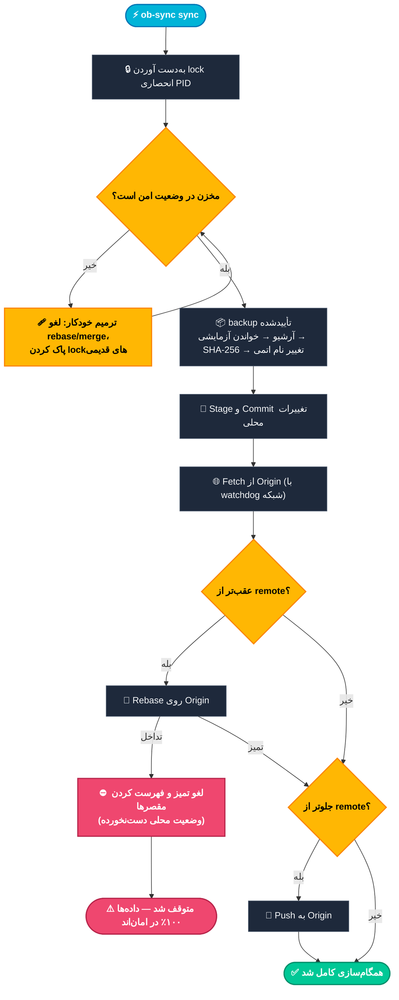

[English](README.md) | [فارسی](README.fa.md) | [Español](README.es.md)

<div id="readme-top" align="center">


**⚡ همگام‌سازی Obsidian ↔ GitHub در سطح سازمانی — از گوشی، از لپ‌تاپ، از هر دستگاه دیگری.**

*یک اسکریپت. سه پلتفرم. صفر وابستگی اضافه. ۹ لایه دفاع.*


[](CHANGELOG.md)
[](LICENSE)
[](#-quick-start)
[](https://www.gnu.org/software/bash/)
[](https://github.com/CheginiSoroush/obsidian-sync-scripts/actions/workflows/lint.yml)

<p align="center">
  <a href="#-شروع-سریع">🚀 شروع سریع</a> •
  <a href="#-منوی-تعاملی">📱 منوی تعاملی (TUI)</a> •
  <a href="#️-مرجع-دستورات">⌨️ مرجع CLI</a> •
  <a href="#️-۹-لایه-دفاع">🛡️ دفاع ۹ لایه‌ای</a> •
  <a href="#-کتابچه-بازیابی-اضطراری">🚑 کتابچه بازیابی</a> •
  <a href="#-سوالات-متداول">❓ سوالات متداول</a>
</p>

<p align="center">
  <a href="https://github.com/CheginiSoroush/obsidian-sync-scripts/stargazers"></a>
  <a href="https://github.com/CheginiSoroush/obsidian-sync-scripts/issues"></a>
  <a href="CONTRIBUTING.md"></a>
  <a href="https://cheginisoroush.github.io/obsidian-sync-scripts/"></a>
</p>

<p align="center">
  
</p>

<p align="center"><b>▲ خروجی واقعی، به‌صورت متحرک.</b> یک اجرای واقعیِ ضبط‌شده از <b>ob-sync sync</b> — نه یک ماکت.</p>

---

*«یادداشت‌های شما ارزش بیشتری از این دارند که فقط دست به دعا شوید sync کار کند.»*

<details>
<summary>دوست‌داران ASCII — لوگوی اصلی اینجاست</summary>

<pre>
 ██████╗  ██████╗           ███████╗ ██╗   ██╗ ███╗   ██╗  ██████╗
██╔═══██╗ ██╔══██╗          ██╔════╝ ╚██╗ ██╔╝ ████╗  ██║ ██╔════╝
██║   ██║ ██████╔╝ ███████╗ ███████╗  ╚████╔╝  ██╔██╗ ██║ ██║
██║   ██║ ██╔══██╗ ╚══════╝ ╚════██║   ╚██╔╝   ██║╚██╗██║ ██║
╚██████╔╝ ██████╔╝          ███████║    ██║    ██║ ╚████║ ╚██████╗
 ╚═════╝  ╚═════╝           ╚══════╝    ╚═╝    ╚═╝  ╚═══╝  ╚═════╝
</pre>

</details>

</div>

<p align="center">
  
</p>

<br>

## 🔥 مشکل

شما روی گوشی و لپ‌تاپ خود یادداشت برمی‌دارید و آن‌ها را با Git نسخه‌بندی می‌کنید.
بین همین دو واقعیت، یک جهنم تمام‌عیار پنهان است: شبکه موبایلی که وسط push قطع می‌شود، اندرویدی که هر وقت دلش خواست پروسه‌های پس‌زمینه را می‌کشد، حافظه مشترکی که بیت‌های `exec` ندارد — و تنها یک `git pull` نیمه‌کاره فاصله است تا یک هفته فکر و ایده از دست برود.

بیشتر آدم‌ها تسلیم می‌شوند و به امید باقی می‌مانند. **اما شما مجبور نیستید.**

**`ob-sync`** یک اسکریپت Bash مستقل و تک‌فایلی است که ترمینال شما را به یک موتور sync جنگ‌آزموده برای والت Obsidian شما تبدیل می‌کند — مخصوصاً برای محیط خصمانه حافظه مشترک اندروید مهندسی شده، و روی لینوکس و macOS هم دقیقاً همان‌قدر در خانه است.

| 💀 بدون `ob-sync` | 🛡️ با `ob-sync` |
| :--- | :--- |
| `git pull` نیمه‌کاره، والت شما را در بلاتکلیفی rebase رها می‌کند | **Git خودترمیم** وضعیت‌های خراب را لغو و lockهای قدیمی را خودکار پاک می‌کند |
| قطع شدن شبکه وسط push، ترمینال را برای همیشه معلق می‌کند | **Watchdogها** روی هر فراخوانی remote *و* هر عملیات حجیم محلی، مهلت زمانی سخت‌گیرانه اعمال می‌کنند |
| پوشه `.git` خراب یعنی جراحی دستی یا از دست رفتن یادداشت‌ها | **ترمیم دومرحله‌ای** متادیتا را به‌صورت اتمی بازسازی می‌کند و فایل‌های محلی دست‌نخورده می‌مانند |
| هیچ تور ایمنی‌ای پیش از عملیات مخرب Git وجود ندارد | **backupهای تأییدشده با SHA-256** پیش از آن‌که *هر* تغییری به والت شما دست بزند اجرا می‌شوند |

> [!IMPORTANT]
> **فلسفه اصلی:** *نه فایل نیمه‌تمام. نه از دست رفتن بی‌سروصدای داده. نه خطای رمزآلود. هرگز.*

---

## 🚀 شروع سریع

### 📱 اندروید (Termux)

```bash
pkg install curl
curl -fsSL https://raw.githubusercontent.com/CheginiSoroush/obsidian-sync-scripts/main/mobile/install.sh | bash

ob-sync doctor     # 1. Verify the environment
ob-sync init       # 2. Clone or adopt your vault (asks for your GitHub repo URL)
ob-sync            # 3. Open the interactive menu
```

### 🖥️ لینوکس و macOS

```bash
git clone https://github.com/CheginiSoroush/obsidian-sync-scripts.git
cd obsidian-sync-scripts
./desktop/install.sh

ob-sync init && ob-sync sync   # init asks for your GitHub repo URL
```

> [!WARNING]
> پایپ کردن اسکریپت نصب به داخل `bash` راحت است اما کورکورانه است. اگر ترجیح می‌دهید قبل از اجرا نگاهی به کد بیندازید، اول [`mobile/install.sh`](mobile/install.sh) یا [`desktop/install.sh`](desktop/install.sh) را مرور کنید یا از روش `git clone` بالا استفاده کنید.

### ✨ همگام‌سازی موفق چه شکلی دارد

▶️ **[تماشای اجرای واقعیِ متحرک](#readme-top)** — یک نشست واقعیِ ضبط‌شده در بالای همین صفحه پخش می‌شود. خروجی دقیق، پایین:

```text
$ ob-sync sync

  Full Synchronization
  ────────────────────────────────────────────────────────
  [1] Checking repository state
  [ OK ] Repository is in a safe state
  [2] Creating pre-sync backup
  [ OK ] Backup: pre-sync-20250612-143207.tar.gz
  [3] Committing local changes
  [ OK ] Committed 3 changed file(s)
  [4] Fetching remote state
  [5] Rebasing onto origin/main (2 remote commit(s))
  [ OK ] Integrated 2 remote commit(s)
  [6] Pushing to origin/main
  [ OK ] Pushed 1 commit(s)

  [ OK ] Sync complete — 2 commit(s) in, 1 commit(s) out
```

---

## 📱 منوی تعاملی

`ob-sync` را بدون هیچ آرگومانی اجرا کنید. روی کیبورد گوشی، تایپ کردن زیردستورها آزاردهنده است — **کل ماجرا همین منوست:**

<p align="center">
  
</p>

<details>
<summary>همان منو، به‌صورت متن ساده</summary>

```text
$ ob-sync

  ──────────────────────────────────────────
     OBSIDIAN SYNC TOOL  ·  v9.5.2
  ──────────────────────────────────────────

  Vault:   /storage/emulated/0/Documents/Obsidian
  Branch:  main
  Changes: 3
  Last:    2025-06-12 14:32:07

  MENU
  ------------------------------------------

  1) Sync      backup + rebase + push
  2) Pull      integrate remote changes
  3) Push      publish local changes
  4) Backup    create a verified backup
  5) Restore   roll back from a backup
  6) Verify    check backup integrity
  7) Repair    rebuild git metadata
  8) Organize  audit notes & attachments
  9) Status    vault overview
  10) Health   git integrity check
  11) Doctor   diagnose environment
  12) Quick    backup + sync, one shot
  13) Diff      pending changes
  14) Config    effective settings
  15) Remote    show or set the remote
  16) Cron      schedule automatic syncs
  17) EditConf  edit the config file
  18) Init      new vault / first-time setup
  0) Exit     quit the tool

  ------------------------------------------

  Select an option [0-18]:
```

</details>

> [!TIP]
> **از پایه در برابر خطا ایمن:** عملیات هرگز نشست تعاملی شما را نمی‌کشند و lock مربوط به PID بین عملیات‌ها به‌تمیزی آزاد می‌شود — اگر دوست دارید، پنج بار پشت سر هم `1` را بزنید.

---

## 🧠 چگونه کار می‌کند

<p align="center">
  
</p>

هر اجرای `ob-sync sync` از همان ماشین حالتِ قطعی و مقاوم در برابر خطا عبور می‌کند — اینجا، قدم‌به‌قدم:



---

## 🛡️ ۹ لایه دفاع

بین شما و از دست رفتن داده‌ها، نه دیوار مستقل ایستاده است — و همین دیوار اول، یک backup زمان‌دار و checksum‌دار است که قبل از *هر چیز* دیگری گرفته می‌شود.

<p align="center">
  
</p>

| لایه | سازوکار | چه چیزی را تضمین می‌کند |
| :---: | :--- | :--- |
| **01** | **Lock با PID** | دو نمونه از ابزار هرگز نمی‌توانند هم‌زمان به والت دست بزنند؛ PIDهای مرده خودکار پس گرفته می‌شوند. |
| **02** | **backupهای تأییدشده** | یک آرشیو فقط وقتی معتبر است که کل جریان آن بدون خطا خوانده شود *و* checksum از نوع SHA-256 آن ثبت شده باشد. |
| **03** | **انتشار اتمی** | backupها اول در فایل‌های `.part` نوشته و بعد اتمی تغییر نام می‌یابند — یک crash هرگز آرشیو نیمه‌نوشته‌ای باقی نمی‌گذارد. |
| **04** | **Watchdogها** | هر فراخوانی Git به remote (watchdog شبکه) و هر عملیات حجیم محلی — آرشیو، هش، `fsck` (watchdog محلی) — تحت مهلت زمانی قابل تنظیم اجرا می‌شود؛ نه اتصال معلق و نه mount مرده نمی‌توانند والت شما را منجمد کنند. |
| **05** | **Git خودترمیم** | rebaseهای ناتمام، mergeهای نیمه‌کاره و فایل‌های `.lock` قدیمی به‌طور خودکار بازیابی می‌شوند. |
| **06** | **ترمیم دومرحله‌ای** | `.git` جایگزین اول clone می‌شود، با `fsck` تأیید و در وضعیت آماده قرار می‌گیرد *قبل از* آن‌که چیزی جابه‌جا شود — با بازگشت آنی. |
| **07** | **نگهبان Tar-Slip** | `restore` پیش از استخراج، تک‌تک اعضای آرشیو را ممیزی می‌کند — مسیرهای مطلق، پیمایش با `..` و symlinkها رد می‌شوند. |
| **08** | **ردیابی فایل‌های موقت** | هر فایل موقتِ زمان اجرا ردیابی و در *هر* مسیر خروج پاکسازی می‌شود — از جمله `Ctrl+C`؛ فایل‌های جامانده از یک `SIGKILL` مهارناپذیر، در اجرای بعدی جمع‌آوری می‌شوند. |
| **09** | **restore فقط افزودنی** | فایل‌های remote هنگام بازیابی فقط زمانی *اضافه* می‌شوند که موجود نباشند؛ ویرایش‌های محلی شما همیشه برنده‌اند. |

---

## ⌨️ مرجع دستورات

### 🔄 همگام‌سازی و گردش کار

| دستور | توضیحات |
| :--- | :--- |
| `ob-sync` | **منوی تعاملی** را باز می‌کند (یا در حالت غیرتعاملی / از طریق cron، یک sync کامل اجرا می‌کند) |
| `ob-sync sync` | خط لوله کامل: `check` → `backup` → `commit` → `fetch` → `rebase` → `push` · با `--json` نتیجه‌ای ماشین‌خوان بگیرید (به [عملیات ماشین‌خوان](#عملیات-ماشینخوان) نگاه کنید) |
| `ob-sync quick` | یک backup تأییدشده می‌سازد و sync کامل را در همان یک قدم اجرا می‌کند · `--json` پشتیبانی می‌شود |
| `ob-sync pull` | اول تغییرات محلی را commit می‌کند، بعد commitهای remote را ادغام می‌کند · `--json` پشتیبانی می‌شود |
| `ob-sync push` | اول تغییرات محلی را commit می‌کند، بعد روی remote منتشر می‌کند · `--json` پشتیبانی می‌شود |
| `ob-sync cron [sub]` | syncهای خودکار را در crontab شما زمان‌بندی می‌کند: `status` (پیش‌فرض)، `install <schedule> [HH:MM]`، `show`، `uninstall` — به [همگام‌سازی زمان‌بندی‌شده](#-اتوماسیون) نگاه کنید |

### 📦 backup، restore و repair

| دستور | توضیحات |
| :--- | :--- |
| `ob-sync backup` | یک آرشیو backup کامل از والت می‌سازد و آن را با SHA-256 تأیید می‌کند · با `--json` نتیجه‌ای ماشین‌خوان بگیرید (به [backupهای ماشین‌خوان](#backupهای-ماشینخوان) نگاه کنید) |
| `ob-sync restore [--list \|--dry-run \|--json] [target]` | از یک backup ممیزی‌شده به عقب برمی‌گردد (`latest`، نام فایل یا مسیر) · `--list` محتوا و checksum را پیش‌نمایش می‌کند · `--dry-run` کل عملیات restore را بدون هیچ تغییری تمرین می‌کند · `--list --json` پیش‌نمایش/فهرست ماشین‌خوان تولید می‌کند · `--json <target> -y` نتیجه‌ای ماشین‌خوان از restore برمی‌گرداند — مناسب رزمایش‌های بازیابی اضطراریِ اسکریپتی (به [backupهای ماشین‌خوان](#backupهای-ماشینخوان) نگاه کنید) |
| `ob-sync verify [--json]` | یکپارچگی رمزنگارانه **همه** backupهای ذخیره‌شده را ممیزی می‌کند — `--json` آرایه نتیجه به‌ازای هر آرشیو را گزارش می‌کند (به [backupهای ماشین‌خوان](#backupهای-ماشینخوان) نگاه کنید) |
| `ob-sync repair` | متادیتای `.git` را به‌صورت اتمی از remote بازسازی می‌کند و همه فایل‌های محلی را حفظ می‌کند |
| `ob-sync remote [url]` | URL مخزن remote را نشان می‌دهد — یا یک URL جدید تنظیم می‌کند که برای شل‌های cron هم ذخیره می‌شود |

### 🩺 عیب‌یابی و بهداشت والت

| دستور | توضیحات |
| :--- | :--- |
| `ob-sync organize [--fix]` | یادداشت‌های خالی، فایل‌های حجیم و پیوست‌های بی‌سرپرست را ممیزی می‌کند (`--fix` یتیم‌ها را جابه‌جا می‌کند) · با `--json` یک گزارش ممیزی ماشین‌خوان بگیرید — `--fix --json` گزارش فایل‌های جابه‌جاشده را برمی‌گرداند (به [همه‌چیز ماشین‌خوان](#همهچیز-ماشینخوان) نگاه کنید) |
| `ob-sync diff` | تغییرات در انتظارِ درخت کاری را با برچسب‌های خوانا و آمار diff نشان می‌دهد (فقط خواندنی) |
| `ob-sync history [n]` | آخرین `n` commit والت را با تاریخ‌های نسبی فهرست می‌کند (فقط خواندنی) · با `--json` یک سند commit ماشین‌خوان بگیرید (به [همه‌چیز ماشین‌خوان](#همهچیز-ماشینخوان) نگاه کنید) |
| `ob-sync config` | پیکربندی مؤثر و منبع هر مقدار را نشان می‌دهد (فقط خواندنی) |
| `ob-sync doctor [--json]` | سازگاری پلتفرم، ابزارهای لازم، دسترسی‌های حافظه، remote و watchdogها را بررسی می‌کند — و وقتی backupها با والت یک فایل‌سیستم مشترک دارند هشدار می‌دهد · `--json` گزارش بررسی‌های ماشین‌خوان تولید می‌کند (به [عیب‌یابی ماشین‌خوان](#عیبیابی-ماشینخوان) نگاه کنید) |
| `ob-sync status [--json]` | مروری تمیز از شاخه، تغییرات در انتظار و وضعیت sync والت ارائه می‌دهد — `--json` خروجی ماشین‌خوان برای اسکریپت‌ها و داشبوردها تولید می‌کند |
| `ob-sync health [--json]` | یک `git fsck` عمیق و بررسی یکپارچگی مخزن اجرا می‌کند — `--json` گزارش بررسی‌های مرحله‌به‌مرحله و آمار تولید می‌کند (به [عیب‌یابی ماشین‌خوان](#عیبیابی-ماشینخوان) نگاه کنید) |
| `ob-sync init` | راه‌اندازی اولیه تعاملی: clone کردن والت remote یا پذیرفتن یک پوشه موجود |
| `ob-sync log [n]` | فعالیت‌های اخیر sync و commit را نشان می‌دهد (به‌طور پیش‌فرض `n` مورد آخر) · با `--json` یک سند فعالیت ماشین‌خوان بگیرید |
| `ob-sync edit-conf` | فایل پیکربندی مخصوص همین دستگاه را در `$EDITOR` باز می‌کند (در اولین استفاده، یک قالب آغازین کامنت‌دار می‌سازد) |

**پرچم‌های سراسری و کدهای خروج:**

* **پرچم‌ها:** `-y, --yes` (تأیید خودکار) · `-n, --no-color` (خروجی ساده) · `-h, --help` · `-v, --version`
* **کدهای خروج:** `0` موفقیت · `1` شکست عملیاتی · `2` تداخل lock (نمونه دیگری در حال اجراست)

---

## ⚙️ پیکربندی

هیچ متغیر محیطی لازم نیست — `ob-sync init` انتخاب‌های شما را در پیکربندی مخصوص همان دستگاه می‌نویسد. با این حال همه‌چیز قابل بازنویسی است:

| متغیر | پیش‌فرض | توضیحات |
| :--- | :--- | :--- |
| `OBS_VAULT` | `~/storage/shared/Documents/Obsidian` *(Termux)*<br>`~/Documents/Obsidian` *(دسکتاپ)* | مسیر والت Obsidian شما |
| `OBS_CONFIG` | `~/.config/ob-sync/config` | پیکربندی ماندگار مخصوص هر دستگاه که `VAULT`، `REMOTE` و `BRANCH` را ذخیره می‌کند (توسط `init` / `remote` نوشته می‌شود)؛ اولویت تشخیص مقدار: `OBS_VAULT` > فایل پیکربندی > تشخیص خودکار |
| `OBS_REMOTE` | *(تنظیم‌نشده — توسط `init` پرسیده می‌شود؛ از طریق `remote <url>` قابل تنظیم)* | URL مخزن Git |
| `OBS_BRANCH` | `main` | شاخه Git مورد پیگیری |
| `OBS_BACKUP_DIR` | `~/obsidian-backups` | پوشه‌ای که آرشیوهای `.tar.gz` و checksumها در آن ذخیره می‌شوند |
| `OBS_KEEP_BACKUPS` | `10` | تعداد backupهای چرخشی که نگه داشته می‌شوند (`0` = نگه‌داشتن همه) |
| `OBS_LOG` | `~/ob-sync.log` | مسیر فایل لاگ (برای غیرفعال کردن لاگ، `""` تنظیم کنید) |
| `OBS_GIT_TIMEOUT` | `120` | مهلت زمانی watchdog شبکه بر حسب ثانیه (`0` غیرفعالش می‌کند) |
| `OBS_LOCAL_TIMEOUT` | `600` | مهلت زمانی watchdog محلی بر حسب ثانیه برای آرشیو tar، هش کردن و `fsck` (`0` غیرفعالش می‌کند) |
| `OBS_CRON_LOG` | `~/ob-sync-cron.log` | فایل خروجی اجراهایی که `ob-sync cron install` آغاز می‌کند |
| `OBS_SKIP_BACKUP` | `0` | برای رد شدن از backup ایمنیِ پیش از sync، روی `1` بگذارید |
| `OBS_ATTACH_DIR` | `Attachments` | پوشه مقصد هنگام اجرای `ob-sync organize --fix` |
| `OB_DISCOVER_ROOTS` | *(تنظیم‌نشده — `~/Documents`، `~/Obsidian`، `~/vaults` به‌علاوه نقاط اتصال `/media`، `/run/media/<user>`، `/mnt`)* | بازنویسیِ جداشده با «:» برای پوشه‌هایی که سوییچر vault جست‌وجو می‌کند |

**مثال — sync سریع و بدون حضور کاربر:**

```bash
OBS_SKIP_BACKUP=1 OBS_GIT_TIMEOUT=300 ob-sync sync
```

---

## 🚑 کتابچه بازیابی اضطراری

وقتی اوضاع از کنترل خارج شد، دستپاچه نشوید — دستور متناسب را اجرا کنید:

| علامت / سناریو | دستور قابل اجرا | چه اتفاقی می‌افتد |
| :--- | :--- | :--- |
| *"Repository not in a safe state"* | `ob-sync sync` | rebase/mergeهای نیمه‌کاره را خودترمیم و lockهای مرده را پاک می‌کند |
| sync به طرز مرموزی مدام شکست می‌خورد | `ob-sync health` | عیب‌یابی عمیق اشیاء Git و ایندکس را اجرا می‌کند |
| پوشه `.git` خراب شده است | `ob-sync repair` | `.git` را در محیط آماده‌سازی از نو clone و تأیید می‌کند و به‌صورت امن جایگزین می‌شود |
| *«یادداشت‌های امروز صبحم را می‌خواهم»* | `ob-sync restore latest` | checksum و ایمنی tar-slip را تأیید می‌کند و آخرین snapshot شما را برمی‌گرداند |
| *«داخل این backup چیست؟»* | `ob-sync restore --list latest` | آرشیو را تأیید، همه اعضا را ممیزی و اندازه‌ها، تعداد یادداشت‌ها و چیدمان سطح بالا را نشان می‌دهد — بدون استخراج |
| به خراب بودن یک آرشیو backup مشکوکید | `ob-sync verify` | تجزیه جریان و هش‌های SHA-256 را روی همه backupها آزمایش می‌کند |
| همه‌چیز در محیط مشکوک به نظر می‌رسد | `ob-sync doctor` | نسخه Bash، coreutils، دسترسی‌های حافظه و احراز هویت SSH/PAT را بررسی می‌کند |
| **فاجعه کامل** | `tar -xzf <backup>.tar.gz` | backupها آرشیوهای استاندارد `.tar.gz` هستند — هرجا، هر وقت، استخراجشان کنید |

📖 **عیب‌یابی عمیق‌تر لازم دارید؟** [راهنمای عیب‌یابی](docs/TROUBLESHOOTING.md) کامل را ببینید.

---

## 🤖 اتوماسیون

کدهای خروج سخت‌گیرانه، مستند و پایدارند. وقتی به‌صورت غیرتعاملی (بدون TTY) فراخوانی شود، `ob-sync` ساده **به‌طور خودکار به یک sync کامل پیش‌فرض می‌شود** — آن را در هر زمان‌بندی‌ای بیندازید، بدون هیچ دردسری کار می‌کند.

### همگام‌سازی زمان‌بندی‌شده (`cron`)

با یک دستور، sync خودکار را روشن کنید — بدون ویرایش دستی crontab:

```bash
ob-sync cron install hourly               # presets: 15min · 30min · hourly · daily [HH:MM]
ob-sync cron install daily 09:30          # every morning at 09:30
ob-sync cron install "*/5 9-18 * * 1-5"   # or any raw 5-field cron expression
ob-sync cron status                       # show the scheduled job
ob-sync cron uninstall                    # remove it (asks; add -y in scripts)
```

`cron install` یک **بلوک جداشده با نشانگر** در crontab کاربر شما می‌نویسد — نصب دوباره، همان بلوک را درجا به‌روز می‌کند و به بقیه ورودی‌های cron شما دست نمی‌زند. این job مسیر مطلق `ob-sync` و `PATH` فعلی شما را ثابت نگه می‌دارد (محیط cron هیچ‌کدام را به ارث نمی‌برد)، خروجی را برای عیب‌یابی به `~/ob-sync-cron.log` اضافه می‌کند و اگر هنوز remote یا والتی پیکربندی نشده باشد، از همان ابتدا هشدار می‌دهد.

> [!TIP]
> **Termux اول به یک cron daemon نیاز دارد:** `pkg install cronie termux-services && sv-enable crond`.

<details>
<summary>crontab دست‌نویس را ترجیح می‌دهید؟</summary>

این هم هنوز کار می‌کند — `ob-sync` ساده، شل‌های غیرتعاملی را تشخیص می‌دهد و یک sync کامل اجرا می‌کند:

```bash
*/30 * * * * ob-sync sync >> ~/ob-sync-cron.log 2>&1
```

</details>

### همه‌چیز ماشین‌خوان

مرور یک‌نگاهیِ سطح ماشینی — **چهارده سند در سیزده دستور**. هر دستور `--json` همین سه چیز را تضمین می‌کند: سند **تنها** چیزی است که روی stdout می‌رود، پیام‌های عیب‌یابیِ انسانی به stderr می‌روند و کد خروج همیشه همانِ دستور انسانی است:

| دستور | نکات کلیدی سند | قرارداد شکست |
| :--- | :--- | :--- |
| `status --json` | platform، vault، git، backups، watchdogs، cron، config، `last_sync` | هرگز شکست نمی‌خورد (rc 0) |
| `sync --json` · `pull --json` · `push --json` · `quick --json` | یک شکل مشترک: result، branch، remote، pulled/pushed/committed/conflicts، backup، elapsed | `{ "result": "error", "error": { "code", "message" } }`، rc 1 |
| `backup --json` | نام backup، مسیر، اندازه دقیق، وضعیت sidecar | `backup: null` + خطا، rc 1 |
| `restore --list --json` | فهرست کل پوشه یا پیش‌نمایش هر آرشیو | `{ "error": … }`، rc 1 |
| `restore --json <target> -y` | نتیجه اعمال: آرشیو، `safety_backup`، `previous_vault`، زمان سپری‌شده | کد خطای پایدار، rc 1؛ rc 2 وقتی lock مشغول است |
| `verify --json` | ردیف به‌ازای هر آرشیو + `total` / `passed` / `failed` | `verification_failed`، rc 1 |
| `health --json` | هفت ردیف بررسی + بلوک statistics | `health_issues` / `health_failed`، rc 1 |
| `doctor --json` | آرایه بررسی‌ها (`ok`/`warn`/`fail`/`info`) | `result: "error"` وقتی حداقل یک بررسی شکست خورده باشد، rc 1 |
| `log --json [n]` | `entries[{timestamp, source, message}]` | `log_unreadable` با rc 1؛ لاگ ناموجود، داده خالیِ معتبر است، rc 0 |
| `history --json [n]` | `commits[{hash, date, author, subject}]` — SHA-1 کامل، تاریخ‌های ISO 8601 | `history_unreadable` با rc 1؛ مخزن تازه‌ساخت، داده خالیِ معتبر است، rc 0 |
| `organize --json [--fix]` | ممیزی والت: شمارنده‌های scan، untitled/empty/oversized (با بایت دقیق)، یتیم‌ها؛ با `--fix`: `moved[{from, to}]`، `skipped[{file, reason}]` | `scan_failed` / `attach_dir_create_failed` با rc 1؛ scan هرگز lock نمی‌گیرد، fix با `lock_busy` جواب می‌دهد، rc 2 |

جدول کامل کدهای خطا (به همراه کمک اولیه هر کدام) در [راهنمای عیب‌یابی](docs/TROUBLESHOOTING.md#machine-readable-modes---json) قرار دارد.

`log --json` لاگ فعالیت خود ob-sync را به داده تبدیل می‌کند — به‌ازای هر رکورد یک ردیف با `timestamp`، `source` (تابع صادرکننده) و `message`؛ به این ترتیب اتوماسیون می‌تواند ناوگان cron را با `jq` زیر نظر بگیرد، به‌جای آن‌که متن آزاد را تجزیه کند. فایل لاگ ناموجود یا غیرفعال، داده خالیِ معتبر است (`log_file: null`، rc 0)؛ rc 1 مخصوص فایلی است که موجود است اما خواندنی نیست:

```console
$ ob-sync log --json 3
{
  "version": "9.5.2",
  "command": "log",
  "log_file": "~/ob-sync.log",
  "requested": 3,
  "count": 3,
  "entries": [
    { "timestamp": "2025-06-12 14:32:07", "source": "main", "message": "invoked: sync" },
    { "timestamp": "2025-06-12 14:32:08", "source": "make_backup", "message": "Backup created: pre-sync-20250612-143208.tar.gz (tar rc=0)" },
    { "timestamp": "2025-06-12 14:32:10", "source": "sync_run", "message": "Sync OK — pulled=2 pushed=1" }
  ],
  "error": null
}

$ ob-sync log --json 50 | jq -r '.entries[] | select(.message | test("ERROR")) | .timestamp'   # recent failures
```

`history --json` تاریخچه commitهای والت را به داده تبدیل می‌کند — به‌ازای هر commit یک ردیف با **هش کامل SHA-1** (بدون ابهام؛ اگر خواستید با `jq` کوتاهش کنید)، **تاریخ اکید ISO 8601** (پایدار و قابل مرتب‌سازی، برخلاف تاریخ نسبیِ «2 hours ago» در نمای انسانی)، نویسنده و موضوع. مخزن تازه‌ساخت بدون هیچ commit، داده خالیِ معتبر است (`count: 0`، rc 0)؛ rc 1 مخصوص مخزنی است که اصلاً قابل خواندن نیست:

```console
$ ob-sync history --json 2
{
  "version": "9.5.2",
  "command": "history",
  "requested": 2,
  "count": 2,
  "commits": [
    { "hash": "8f2a1c4b7e93d0a6f5c21804bb7d1e2f9a4c5d60", "date": "2025-06-12T14:32:10+02:00", "author": "Soroush", "subject": "sync: automated snapshot" },
    { "hash": "3b9d0e7a1f46c2859d0b3e7f4a1c5d8e2b6f9071", "date": "2025-06-12T09:14:55+02:00", "author": "Soroush", "subject": "sync: automated snapshot" }
  ],
  "error": null
}

$ ob-sync history --json 50 | jq -r '[.commits[].date] | min'   # when was the vault born?
```

`organize --json` ممیزی والت در قالب یک سند است: شمارنده‌های scan، فهرست‌های untitled / empty / oversized (با بایت دقیق) و فهرست یتیم‌ها. در حالت `--fix` به یک **گزارش فایل‌های جابه‌جاشده** تبدیل می‌شود — هر فایلی که به پوشه پیوست‌ها می‌رسد در `moved` ثبت می‌شود و هر چیزی که نتوانست جابه‌جا شود (تداخل نام، از قبل سر جای خود) با یک دلیل در `skipped` ثبت می‌شود — تا پاک‌سازی اسکریپتی بتواند نتیجه خودش را تأیید کند، به‌جای آن‌که به یک خط خلاصه اعتماد کند:

```console
$ ob-sync organize --fix --json
{
  "version": "9.5.2",
  "command": "organize",
  "mode": "fix",
  "result": "ok",
  "vault": "~/Documents/Obsidian",
  "attach_dir": "Attachments",
  "scan": { "notes": 214, "attachments": 96, "other": 3 },
  "untitled": [ ],
  "empty_notes": [ ],
  "oversized": [ ],
  "orphans": [ "Attachments/stray.png", "loose.png" ],
  "moved": [ { "from": "loose.png", "to": "Attachments/loose.png" } ],
  "skipped": [ { "file": "Attachments/stray.png", "reason": "already in attachments dir" } ],
  "elapsed_seconds": 0,
  "error": null
}

$ ob-sync organize --fix --json | jq -r '.moved[].to'   # what just moved?
```

### وضعیت ماشین‌خوان

`status --json` یک سند پایدار و escape‌شده از نظر JSON چاپ می‌کند (booleanها boolean واقعی‌اند، مقادیر ناموجود `null` هستند) — عالی برای داشبوردها، اسکریپت‌های Tasker یا مانیتورینگ. سند JSON **تنها** چیزی است که روی stdout می‌رود: اعلان‌های روبه‌کاربر مثل تشخیص خودکار والت سرکوب می‌شوند (و به جایشان لاگ می‌شوند)، پس پارسرها هرگز با داده ناخواسته روبه‌رو نمی‌شوند:

```console
$ ob-sync status --json
{
  "version": "9.5.2",
  "platform": "linux",
  "vault":  { "path": "~/Documents/Obsidian", "exists": true, "notes": 412, "size_bytes": 28411596 },
  "git":    { "installed": true, "initialized": true, "branch": "main",
              "remote": "git@github.com:you/vault.git", "changes": 3,
              "last_commit": { "hash": "a1b2c3d", "subject": "chore(sync)", "date": "2 hours ago" },
              "ahead": 1, "behind": 0 },
  "backups":  { "total": 10, "retention": 10, "directory": "~/obsidian-backups" },
  "watchdogs": { "network_seconds": 120, "local_seconds": 600 },
  "cron":     { "available": true, "scheduled": true,
                "job": "0 * * * * \"~/bin/ob-sync\" sync >> \"~/ob-sync-cron.log\" 2>&1",
                "log": "~/ob-sync-cron.log" },
  "config":   { "file": "~/.config/ob-sync/config", "exists": true, "vault_source": "config file" },
  "last_sync": "2025-06-12 14:32:07"
}

$ ob-sync status --json | jq -r '.git.changes'   # → 3
$ ob-sync status --json | jq -r '.cron.scheduled' # → true
```

فیلد `config.vault_source` پاسخ سوال همیشگی *«چرا دارد آن پوشه را sync می‌کند؟»* است — دقیقاً گزارش می‌دهد والت چطور تشخیص داده شده است: `environment`، `config file`، `auto-detected`، `selected` یا `default`.

### عملیات ماشین‌خوان

هر چهار عملیات داده‌ای — `sync`، `pull`، `push` و `quick` — `--json` را می‌پذیرند و **یک شکل سند پایدار و مشترک** روی stdout تحویل می‌دهند؛ پس یک پارسر واحد، همه hookهای اتوماسیون، wrapperهای cron و jobهای CI را پوشش می‌دهد. خط لوله بایت‌به‌بایت همان حالت انسانی است (backup، commit، fetch، rebase، push)، قرارداد کد خروج تغییر نکرده (`0` = موفقیت، `1` = شکست) و شکست‌ها داده‌اند، نه چیزی که باید از لاگ بیرون کشید: هر شکست یک `code` ماشینِ پایدار حمل می‌کند و stdout حتی وقتی خودِ محیط خراب است (نبودن git، نبودن والت، remote دست‌نیافتنی) قابل تجزیه می‌ماند:

```console
$ ob-sync sync --json
{
  "version": "9.5.2",
  "command": "sync",
  "result": "ok",
  "branch": "main",
  "remote": "git@github.com:you/vault.git",
  "pulled": 2,
  "pushed": 1,
  "committed_files": 3,
  "conflicts": 0,
  "backup": "pre-sync-20250612-140001.tar.gz",
  "backup_skipped": false,
  "elapsed_seconds": 4,
  "error": null
}

$ ob-sync sync --json; echo "rc=$?"          # a failed sync, as data:
{
  "result": "error",
  ...
  "error": { "code": "conflict", "message": "Merge conflict — local commits are preserved" }
}
rc=1
```

همین سند از `pull --json`، `push --json` و `quick --json` هم برمی‌گردد و فیلد `command` متناسب تنظیم می‌شود (`pull` همیشه `pushed: 0` را گزارش می‌کند و `push` همیشه `pulled: 0` را). `quick` backup تأییدشده خودش را به‌عنوان `backup` عملیات گزارش می‌کند — آنچه اسکریپت‌ها می‌بینند همان است که روی دیسک نشسته، حتی اگر بخش sync بعدش شکست بخورد:

```console
$ ob-sync quick --json | jq -r '.command, .backup'
quick
quick-20250612-140001.tar.gz
```

جدول کامل کدهای خطا (به همراه کمک اولیه هر کدام) و یک wrapper آماده برای cron، در [راهنمای عیب‌یابی](docs/TROUBLESHOOTING.md#machine-readable-modes---json) قرار دارد. رابط کاربریِ پیشرفت به فایل لاگ و خطاهای انسانی به stderr منتقل می‌شوند؛ پس `ob-sync sync --json 2>>sync.err` هم یک نتیجه قابل تجزیه به شما می‌دهد و هم یک رد ممیزی، در یک خط.

### backupهای ماشین‌خوان

`restore --list --json` همان خط لوله پیش‌نمایش تأییدشده را اجرا می‌کند (بررسی جریان، checksum sidecar، ممیزی اعضا برای tar-slip) اما خروجی JSON تحویل می‌دهد — یک فهرست backup برای مانیتورینگ، یا پیش‌نمایش هر آرشیو پیش از restoreهای اسکریپتی. شکست‌ها هم قابل تجزیه‌اند: یک آرشیو خراب، `{ "error": ... }` با کد خروج `1` برمی‌گرداند:

```console
$ ob-sync restore --list --json                  # whole backup directory, newest first
{
  "directory": "~/obsidian-backups",
  "count": 2,
  "backups": [
    { "name": "pre-sync-20250612-140001.tar.gz", "path": "~/obsidian-backups/pre-sync-20250612-140001.tar.gz",
      "size_bytes": 28311552, "timestamp": "20250612-140001", "mtime": 1749734401,
      "sidecar": true, "sidecar_ok": true },
    { "name": "manual-20250612-091530.tar.gz", "path": "~/obsidian-backups/manual-20250612-091530.tar.gz",
      "size_bytes": 28298240, "timestamp": "20250612-091530", "mtime": 1749717330,
      "sidecar": true, "sidecar_ok": true }
  ]
}

$ ob-sync restore --list --json latest | jq -r '.notes'   # → 412 markdown notes in the archive
```

`sidecar_ok` وقتی آرشیو هنوز فایل checksum همراه (sidecar) ندارد `null` است — در غیر این صورت، نتیجه واقعی تأیید SHA-256 است. یک پوشه backup خالی، داده معتبری است (`"count": 0`، کد خروج `0`)، پس زمان‌بندها و داشبوردها هرگز نیازی به منطق خاصی ندارند.

`backup --json` تصویر را کامل می‌کند: یک snapshot دستی دقیقاً گزارش می‌دهد چه چیزی روی دیسک نشسته است — نام، مسیر، اندازه دقیق و نتیجه تأیید sidecar — بنابراین یک backup اسکریپتی می‌تواند خروجی خودش را بررسی کند، به‌جای آن‌که متن ترمینال را تکه‌تکه بخواند. کدهای خروج تغییر نکرده‌اند (`0` = ساخته شد، `1` = شکست)، هر شکست یک `code` ماشینِ پایدار حمل می‌کند (`backup_failed`، `vault_missing`، `lock_busy`) و `backup: null` دارد:

```console
$ ob-sync backup --json
{
  "version": "9.5.2",
  "command": "backup",
  "result": "ok",
  "backup": { "name": "manual-20250612-140001.tar.gz", "path": "~/obsidian-backups/manual-20250612-140001.tar.gz",
              "size_bytes": 28411596, "sidecar": true, "sidecar_ok": true },
  "elapsed_seconds": 2,
  "error": null
}

$ ob-sync backup --json | jq -e '.backup.sidecar_ok'   # fail the script if the checksum is broken
true
```

`verify --json` حلقه را می‌بندد: یک ممیزی زمان‌بندی‌شده به‌ازای هر آرشیو ذخیره‌شده یک ردیف می‌گیرد — `status` از نوع `ok` / `corrupt`، `size_bytes` دقیق و وضعیت sidecar — در کنار شمارنده‌های `total` / `passed` / `failed`، پس یک هشدار می‌تواند نام دقیق آرشیو آسیب‌دیده را بگوید، نه فقط «تأیید شکست خورده است». مثل `backup --json`، نبودِ sidecar **شکست** نیست (`sidecar_ok` برابر `null` است)؛ کد خروج، آینه‌ی دستور انسانی است (`0` همه تأیید شدند یا چیزی برای تأیید نیست، `1` حداقل یک آرشیو خراب، کد ماشین `verification_failed`). و چون verify فقط خواندنی است و هرگز lock نمی‌گیرد، اجرای آن **هم‌زمان با در جریان بودن یک sync** آمن است:

```console
$ ob-sync verify --json
{
  "version": "9.5.2",
  "command": "verify",
  "result": "ok",
  "backup_dir": "~/obsidian-backups",
  "total": 2,
  "passed": 2,
  "failed": 0,
  "archives": [
    { "name": "manual-20250612-140001.tar.gz", "status": "ok", "size_bytes": 28411596, "sidecar": true, "sidecar_ok": true },
    { "name": "pre-sync-20250612-133000.tar.gz", "status": "ok", "size_bytes": 28398210, "sidecar": true, "sidecar_ok": true }
  ],
  "elapsed_seconds": 1,
  "error": null
}

$ ob-sync verify --json | jq -r '.archives[] | select(.status == "corrupt") | .name'   # → the damaged archive, by name
```

`restore --json <target> -y` داستان backup را از ابتدا تا انتها کامل می‌کند: یک رزمایش بازیابی اضطراریِ اسکریپتی فقط **یک** سند نتیجه تحویل می‌گیرد — کدام آرشیو restore شده (نام، مسیر، اندازه، تأیید sidecar)، `safety_backup` خودکارِ والت جایگزین‌شده، محل نگه‌داشت `previous_vault` و زمان سپری‌شده — تا رزمایش بتواند موفقیت خودش را از دل داده تأیید کند، به‌جای آن‌که متن ترمینال را تکه‌تکه بخواند. حالت JSON هرگز سوال نمی‌پرسد: یک target صریح و `-y` الزامی‌اند، هر رد کردن (نبود رضایت، target ناشناخته، آرشیو خراب، عدم تطابق checksum، عضو tar-slip، تداخل lock) یک `code` ماشینِ پایدار حمل می‌کند و حتی اجرای شکست‌خورده هم دقیقاً گزارش می‌دهد که می‌خواست کدام آرشیو را restore کند:

```console
$ ob-sync restore --json latest -y
{
  "version": "9.5.2",
  "command": "restore",
  "mode": "apply",
  "result": "ok",
  "target": "latest",
  "vault": "~/Documents/Obsidian",
  "archive": { "name": "pre-sync-20250612-140001.tar.gz", "path": "~/obsidian-backups/pre-sync-20250612-140001.tar.gz",
               "size_bytes": 28311552, "sidecar": true, "sidecar_ok": true },
  "safety_backup": "pre-restore-20250612-153000.tar.gz",
  "previous_vault": "~/Documents/Obsidian.pre-restore-20250612-153000",
  "elapsed_seconds": 2,
  "error": null
}

$ ob-sync restore --json latest -y | jq -e '.result == "ok" and .archive.sidecar_ok'   # DR drill gate
true
```

### عیب‌یابی ماشین‌خوان

`doctor --json` کل گزارش عیب‌یابی را به یک آرایه ماشین‌خوان از بررسی‌ها تبدیل می‌کند — یک ردیف برای هر بررسی، هر کدام با یک `name` پایدار، یک `status` از نوع `ok` / `warn` / `fail` / `info` و یک `message` خوانا برای انسان. `result` در سطح بالای سند `"error"` است (و کد خروج `1`) **اگر و فقط اگر حداقل یک بررسی شکست خورده باشد**؛ هشدارها کد خروج `0` را نگه می‌دارند، دقیقاً مثل گزارش انسانی. اسکریپت‌های راه‌اندازی و داشبوردها سلامت را تجزیه می‌کنند، به‌جای آن‌که از روی کدهای خروج حدس بزنند:

```console
$ ob-sync doctor --json
{
  "version": "9.5.2",
  "command": "doctor",
  "result": "ok",
  "platform": "termux",
  "remote": "git@github.com:you/vault.git",
  "default_branch": "main",
  "checks": [
    { "name": "platform",        "status": "ok",   "message": "Termux 0.118 (Android)" },
    { "name": "tools",           "status": "ok",   "message": "All required tools are available" },
    { "name": "storage",         "status": "ok",   "message": "Shared storage is mounted" },
    { "name": "vault",           "status": "ok",   "message": "Vault found and writable (source: config file)" },
    { "name": "backup_dir",      "status": "ok",   "message": "Backup directory is ready (...)" },
    { "name": "backup_topology", "status": "warn", "message": "Backups share a filesystem with the vault (...)" },
    { "name": "remote",          "status": "ok",   "message": "Remote is reachable" },
    { "name": "remote_branch",   "status": "ok",   "message": "Remote default branch 'main' matches configuration" },
    { "name": "watchdogs",       "status": "ok",   "message": "Network watchdog active (120s) · local watchdog active (600s)" },
    { "name": "free_space",      "status": "info", "message": "Free space ($HOME): 15G" }
  ],
  "error": null
}

$ ob-sync doctor --json | jq -r '.checks[] | select(.status == "warn" or .status == "fail") | .name'
backup_topology
```

`doctor --json` اکیداً **فقط خواندنی** است — برخلاف گزارش انسانی، هرگز پوشه backup را نمی‌سازد؛ پس اجرای آن از jobهای مانیتورینگ امن است. والتِ ناموجود به یک ردیف `warn` تنزل پیدا می‌کند (کد خروج همان `0` می‌ماند)؛ والت غیرقابل‌نوشتن یا نبودِ دسترسی حافظه Termux یک ردیف `fail` با `result: "error"` و کد خروج `1` است.

`health --json` همتای سمتِ یکپارچگی مخزن است: بررسی عمیق `git fsck` هم به یک آرایه از بررسی‌ها تبدیل می‌شود — همیشه **همان هفت ردیف** (`git`، `repository`، `head`، `object_database`، `safe_state`، `remote`، `identity`)؛ و مرحله‌هایی که به‌خاطر شکستی پیشین رد شده‌اند، به‌شکل ردیف‌های `info` با پیام "Not checked" گزارش می‌شوند تا داشبوردها بتوانند آن‌ها را موقعیتی ایندکس کنند. یک بلوک `statistics` همان اعدادی را حمل می‌کند که گزارش انسانی چاپ می‌کند (تعداد commitها، فایل‌های ردیابی‌شده، اندازه `.git`، فضای آزاد — بایت‌به‌بایت دقیق، `null` در حالت نامعلوم). کد خروج، همان قرارداد نسخه انسانی را دنبال می‌کند: هشدارها (نبودن remote یا identity، یک وضعیت ناامن) به‌تنهایی اتوماسیون را با `result: "error"` + کد ماشین `health_issues` شکست می‌دهند، در حالی که یک شکست سخت `health_failed` حمل می‌کند:

```console
$ ob-sync health --json
{
  "version": "9.5.2",
  "command": "health",
  "result": "ok",
  "branch": "main",
  "vault": "~/Documents/Obsidian",
  "checks": [
    { "name": "git",             "status": "ok", "message": "git is available" },
    { "name": "repository",      "status": "ok", "message": "Repository exists" },
    { "name": "head",            "status": "ok", "message": "HEAD is valid" },
    { "name": "object_database", "status": "ok", "message": "Object database is intact" },
    { "name": "safe_state",      "status": "ok", "message": "Repository is in a safe state" },
    { "name": "remote",          "status": "ok", "message": "Remote 'origin' is configured" },
    { "name": "identity",        "status": "ok", "message": "Git identity is configured" }
  ],
  "statistics": { "commits": 214, "tracked_files": 431, "git_size_bytes": 10485760, "free_space_bytes": 16106127360 },
  "error": null
}

$ ob-sync health --json | jq -r '.checks[] | select(.status == "warn" or .status == "fail") | .name'
remote
```

هر دو دستور فقط خواندنی و بدون lock هستند — `verify --json` و `health --json` هرگز lock مربوط به PID را نمی‌گیرند؛ پس یک job مانیتورینگ می‌تواند در میانه یک sync، والت را ممیزی کند، بدون آن‌که هرگز یک sync در حال اجرا را مسدود کند (یا توسط آن مسدود شود).

### تکمیل خودکار شل

هر دستور و هر پرچم را با Tab کامل کنید:

**Bash** (عرضه‌شده در [`completions/ob-sync.bash`](completions/ob-sync.bash)):

```bash
# one-time, per-user
mkdir -p ~/.local/share/bash-completion/completions
cp completions/ob-sync.bash ~/.local/share/bash-completion/completions/ob-sync
exec bash   # reload
```

**zsh** (عرضه‌شده در [`completions/_ob-sync`](completions/_ob-sync)):

```bash
# one-time, per-user (fpath must include the directory BEFORE compinit)
mkdir -p ~/.zsh/completions
cp completions/_ob-sync ~/.zsh/completions/
echo 'fpath=(~/.zsh/completions $fpath)' >> ~/.zshrc
exec zsh    # reload
```

> [!TIP]
> **کاربران oh-my-zsh:** فایل را داخل `~/.oh-my-zsh/completions/` بیندازید — آن پوشه از قبل روی `fpath` شماست. کاربران Termux: `pkg install zsh-completions` و از روش `fpath` بالا استفاده کنید.

---

## 🗂️ معماری مخزن

```text
obsidian-sync-scripts/
├── bin/
│   └── ob-sync               # The entire engine: one platform-aware Bash script
├── mobile/
│   └── install.sh            # Termux environment setup & installer
├── desktop/
│   └── install.sh            # Linux / macOS installer
├── completions/
│   ├── ob-sync.bash          # Bash tab-completion for every command & flag
│   └── _ob-sync              # zsh tab-completion for every command & flag
├── tests/
│   └── run-tests.sh          # Functional test suite — 330 assertions, no network needed
├── docs/
│   ├── TROUBLESHOOTING.md    # Symptom index + deep-dive recovery guides
│   └── menu.svg              # Real terminal capture of the interactive TUI
└── .github/
    └── workflows/            # CI: ShellCheck + tests + markdownlint · Releases: automated on tag push
```

**یک هسته، سه پلتفرم:** اسکریپت در زمان اجرا تشخیص می‌دهد که با Termux، لینوکس یا macOS طرف است و پیش‌فرض‌ها، بررسی‌های فایل‌سیستم و راهنماهای بازیابی را خودکار وفق می‌دهد. رفتارهای خاص هر پلتفرم (userland های BSD در برابر GNU) پشت helperهای تمیز و پرتابل ایزوله شده‌اند — و هرگز ماجرا به فورک‌های شلخته نمی‌رسد.

---

## 🧪 تست

این مخزن مجموعه تست عملکردی خودش را همراه دارد. یک sandbox یک‌بارمصرف می‌سازد (یک remote bare محلی، دو دستگاه شبیه‌سازی‌شده، `$HOME` ایزوله، یک `crontab` شبیه‌سازی‌شده) و بعد اسکریپت واقعی را در سناریوهای sync، تداخل، خرابی، backup، restore، lock، cron و ویرایش پیکربندی می‌رانَد — **نه به شبکه نیاز دارد و نه به root**:

```bash
bash tests/run-tests.sh     # PASS=330 FAIL=0 → exit code 0
```

CI روی هر push و هر pull request، ShellCheck (پین‌شده روی v0.11.0)، کل مجموعه تست و markdownlint را اجرا می‌کند.

---

## ❓ سوالات متداول

<details>
<summary><b>🔒 آیا داده‌های من واقعاً در امان هستند؟</b></summary>
<br>

بله. هر عملیات تغییردهنده با یک **backup تأییدشده** شروع می‌شود — خواندن آزمایشی و checksum از نوع SHA-256 — پیش از هر کار دیگری. عملیات فایل از تغییر نام اتمی `.part` استفاده می‌کنند. restoreها پیش از استخراج، تک‌تک اعضای آرشیو را ممیزی می‌کنند. این معماری از پیش فرض کرده که خرابی رخ خواهد داد و برای آن برنامه دارد.
</details>

<details>
<summary><b>🔑 چطور یک مخزن خصوصی GitHub را sync کنم؟</b></summary>
<br>

credential store مربوط به Git را پیکربندی کنید و یک بار با Personal Access Token (PAT) خود احراز هویت شوید:

```bash
git config --global credential.helper store
git ls-remote https://github.com/you/private-vault.git   # Enter your PAT once
```

اگر `ob-sync doctor` یک remote دست‌نیافتنی تشخیص دهد، دقیقاً همین راهنما را چاپ می‌کند.
</details>

<details>
<summary><b>📱 اگر اندروید Termux را وسط sync بکشد چه می‌شود؟</b></summary>
<br>

این دقیقاً همان سناریویی است که `ob-sync` برای آن ساخته شده:

1. در اجرای بعدی، lock از طریق PID متوجه ID پروسه مرده می‌شود و خودش را پس می‌گیرد.
2. هر backup نیمه‌نوشته فقط به شکل یک فایل `.part` وجود دارد و خودکار جمع‌آوری می‌شود.
3. هر rebase یا merge ناتمام، پیش از از سر گرفتن sync، به‌تمیزی و به‌طور خودکار لغو می‌شود.

</details>

<details>
<summary><b>🍎 پیش‌نیازهای macOS چیست؟</b></summary>
<br>

`brew install bash coreutils` را اجرا کنید تا دو شکاف macOS پوشش داده شود (Bash 4 به بالا و ابزار watchdog یعنی `timeout`). بقیه — هش SHA-256 از طریق `shasum`، اندازه‌گیری پرتابل فایل‌ها و پرچم‌های BSD — خودکار مدیریت می‌شود.
</details>

<details>
<summary><b>🧩 چرا مستقیم از افزونه Obsidian Git جامعه استفاده نکنم؟</b></summary>
<br>

کاملاً می‌توانید — و روی یک والت حتی به‌صورت مسالمت‌آمیز کنار هم زندگی می‌کنند! `ob-sync` برای زمانی است که می‌خواهید:

* sync پس‌زمینه یا از نوع cron (`ob-sync cron install hourly`) **بدون باز کردن Obsidian**
* تاب‌آوری سخت‌گیرانه روی **حافظه مشترک اندروید**
* **backupهای `.tar.gz` تأییدشده از نظر رمزنگارانه** بیرون از تاریخچه Git
* یک ابزار ترمیم اتمی **`.git`** برای زمانی که crashهای موبایل مخزن شما را خراب می‌کنند

</details>

---

## 🤝 مشارکت و مجوز

مشارکت، گزارش باگ و روایت نبردهای شما با حالت‌های مرزی خوش‌آمدند! لطفاً اول [CONTRIBUTING.md](CONTRIBUTING.md) را بخوانید — گیت ShellCheck در CI و قواعد سخت‌گیرانه پرتابل‌بودن، این کدبیس را به بهترین معنای کلمه بی‌ماجرا نگه می‌دارند.

تحت **[مجوز MIT](LICENSE)** منتشر شده است.

<br>

<div align="center">

---

<p align="center">
  
</p>

**ساخته‌شده با 🖤 برای همه کسانی که بهترین ایده‌هایشان دور از کیبورد به سراغشان می‌آید.**

⭐ **اگر `ob-sync` والت شما را نجات داده، یک ستاره روی GitHub صمیمانه‌ترین تشکلی است که می‌توانید بدهید.** ⭐

<br>

[⬆️ بازگشت به بالا](#readme-top)

</div>
