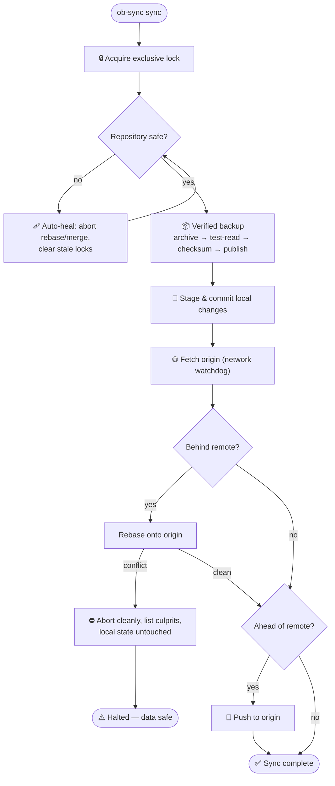

<div align="center">

 ██████╗ ███████╗██████╗ ███████╗██╗   ██╗███╗   ██╗ ██████╗
██╔═══██╗██╔════╝██╔══██╗██╔════╝╚██╗ ██╔╝████╗  ██║██╔════╝
██║   ██║███████╗██████╔╝███████╗ ╚████╔╝ ██╔██╗ ██║██║
██║   ██║╚════██║██╔══██╗╚════██║  ╚██╔╝  ██║╚██╗██║██║
╚██████╔╝███████║██║  ██║███████║   ██║   ██║ ╚████║╚██████╗
 ╚═════╝ ╚══════╝╚═╝  ╚═╝╚══════╝   ╚═╝   ╚═╝  ╚═══╝ ╚═════╝
'''

### ⚡ Enterprise-grade Obsidian ↔ GitHub sync — from your phone, your laptop, your anything.

**One script. Three platforms. Zero extra dependencies. Nine layers of defense.**

[](CHANGELOG.md)
[](LICENSE)
[](#-quick-start)
[](https://www.gnu.org/software/bash/)
[](.github/workflows/lint.yml)

*Your notes deserve better than "hope the sync works."*

</div>

---

## 📖 Table of Contents

- [📖 Table of Contents](#-table-of-contents)
- [🔥 The Problem](#-the-problem)
- [🚀 Quick Start](#-quick-start)
  - [📱 Android (Termux)](#-android-termux)
  - [🖥️ Linux / macOS](#️-linux--macos)
- [📱 The Interactive Menu](#-the-interactive-menu)
- [⌨️ Command Reference](#️-command-reference)
- [🧠 How It Works](#-how-it-works)
- [🛡️ The 9 Layers of Defense](#️-the-9-layers-of-defense)
- [⚙️ Configuration](#️-configuration)
- [🚑 Disaster Recovery Playbook](#-disaster-recovery-playbook)
- [🤖 Automation](#-automation)
- [🗂️ Repository Structure](#️-repository-structure)
- [❓ FAQ](#-faq)
- [🤝 Contributing · 📜 License](#-contributing---license)

---

## 🔥 The Problem

You take notes on your phone and your laptop. You version them with Git.
Between those two facts lives a hellscape: mobile networks that die mid-push,
Android killing processes whenever it feels like it, shared storage with no
exec bits — and one interrupted `git pull` away from a week of lost thoughts.

Most people give up and hope. You don't have to.

**ob-sync** is a single, self-contained Bash script that turns your terminal
into a battle-hardened sync engine for your Obsidian vault — engineered for
the hostile environment that is Android shared storage, and equally at home
on Linux and macOS.

> **Philosophy:** *No half-finished files. No silent data loss. No cryptic errors. Ever.*

---

## 🚀 Quick Start

### 📱 Android (Termux)

```bash
 ###   #              ####  #   #  #   #   #### 
#   #  #             #      #   #  ##  #  #     
#   #  ####    ###    ####   # #   # # #  #     
#   #  #   #             #    #    #  ##  #     
 ###   ####           ####    #    #   #   #### 
```

### 🖥️ Linux / macOS

```bash
git clone https://github.com/CheginiSoroush/obsidian-sync-scripts.git
cd obsidian-sync-scripts
./desktop/install.sh

ob-sync doctor && ob-sync init && ob-sync sync
```

> ⚠️ Piping installers into `bash` is convenient but blind — review
> [`mobile/install.sh`](mobile/install.sh) or [`desktop/install.sh`](desktop/install.sh)
> first if that bothers you. The clone method above avoids it entirely.

**What a successful sync looks like:**

```
$ ob-sync sync

  Full Synchronization
  ────────────────────────────────────────────────────────
  [1] Checking repository state
  [ OK ] Repository is in a safe state
  [2] Creating pre-sync backup
  [ OK ] Backup: pre-sync-20250612-143207.tar.gz
  [3] Committing local changes
  [ OK ] Committed 3 changed file(s)
  [4] Fetching remote state
  [5] Rebasing onto origin/main (2 remote commit(s))
  [ OK ] Integrated 2 remote commit(s)
  [6] Pushing to origin/main
  [ OK ] Pushed 1 commit(s)

  [ OK ] Sync complete — 2 commit(s) in, 1 commit(s) out
```

---

## 📱 The Interactive Menu

Run `ob-sync` with no arguments. On a phone, this is the whole point:

```
$ ob-sync

  ──────────────────────────────────────────
     OBSIDIAN SYNC TOOL  ·  v8.0.0
  ──────────────────────────────────────────

  Vault:   /storage/emulated/0/Documents/Soroush
  Branch:  main
  Changes: 3
  Last:    2025-06-12 14:32:07

  MENU
  ------------------------------------------

  1) Sync      backup + rebase + push
  2) Pull      integrate remote changes
  3) Push      publish local changes
  4) Backup    create a verified backup
  5) Restore   roll back from a backup
  6) Verify    check backup integrity
  7) Repair    rebuild git metadata
  8) Organize  audit notes & attachments
  9) Status    vault overview
  10) Health   git integrity check
  11) Doctor   diagnose environment
  12) Quick    backup + sync, one shot
  0) Exit     quit the tool

  ------------------------------------------

  Select an option [0-12]:
```

The menu is **error-proof by design**: operations never kill the session, and
the lock is released between actions — press `1` five times in a row if you like.

---

## ⌨️ Command Reference

| Command | Description |
|---|---|
| `ob-sync` | Interactive menu (or full sync when non-interactive — cron-safe) |
| `ob-sync sync` | Full pipeline: check → backup → commit → fetch → rebase → push |
| `ob-sync quick` | One verified backup + full sync in a single shot |
| `ob-sync pull` / `push` | Commit local changes, then integrate / publish |
| `ob-sync backup` | Create and verify a full vault backup |
| `ob-sync restore [target]` | Roll back from an audited backup (`latest`, filename, or path) |
| `ob-sync verify` | Audit the integrity of **every** stored backup |
| `ob-sync repair` | Atomically rebuild git metadata from remote — files preserved |
| `ob-sync organize [--fix]` | Audit empty notes, big files & orphaned attachments; `--fix` relocates orphans |
| `ob-sync doctor` | Diagnose platform, tools, storage, remote, watchdog |
| `ob-sync status` / `health` / `init` / `log [n]` | Overview · integrity check · first-time setup · recent activity |

**Options:** `-y/--yes` · `-n/--no-color` · `-h/--help` · `-v/--version`
**Exit codes:** `0` success · `1` failure · `2` another instance running

---

## 🧠 How It Works



---

## 🛡️ The 9 Layers of Defense

| # | Layer | Guarantees |
|---|---|---|
| 1 | **PID Locking** | Two instances can never touch the vault simultaneously |
| 2 | **Verified Backups** | An archive only counts if the full stream reads back *and* the SHA-256 is recorded |
| 3 | **Atomic Publishing** | Backups are written to `.part` files and renamed — a crash can never leave a half-written archive |
| 4 | **Network Watchdog** | Every remote git call runs under a configurable timeout |
| 5 | **Self-Healing Git** | Interrupted rebases, merges and stale locks are recovered automatically |
| 6 | **Two-Phase Repair** | The replacement `.git` is cloned, fsck-verified and staged *before* anything moves — with rollback |
| 7 | **Tar-Slip Guardian** | `restore` audits every archive member — absolute paths, `..` traversal and symlinks are refused |
| 8 | **Temp Registry** | Every runtime temporary is swept on *any* exit path — including Ctrl+C |
| 9 | **Additive-Only Restore** | Remote files are only ever *added* when missing; your local edits always win |

> **In plain terms:** between you and data loss there are nine independent
> walls — and the first one is a timestamped, checksummed backup taken
> before *anything* else happens.

---

## ⚙️ Configuration

Everything is overridable via environment variables — zero config files:

| Variable | Default | Description |
|---|---|---|
| `OBS_VAULT` | `~/storage/shared/Documents/<vault>` (Termux) · `~/Documents/<vault>` (desktop) | Path to the Obsidian vault |
| `OBS_REMOTE` | *(see script header)* | Git remote URL |
| `OBS_BRANCH` | `main` | Tracked branch |
| `OBS_BACKUP_DIR` | `~/obsidian-backups` | Backup storage location |
| `OBS_KEEP_BACKUPS` | `10` | Retention count (`0` = keep everything) |
| `OBS_LOG` | `~/ob-sync.log` | Log file path (`""` disables logging) |
| `OBS_GIT_TIMEOUT` | `120` | Network timeout in seconds (`0` disables) |
| `OBS_SKIP_BACKUP` | `0` | Set `1` to skip the pre-sync safety backup |
| `OBS_ATTACH_DIR` | `Attachments` | Destination for `organize --fix` |

```bash
OBS_SKIP_BACKUP=1 OBS_GIT_TIMEOUT=300 ob-sync sync   # fast unattended sync
```

---

## 🚑 Disaster Recovery Playbook

| Symptom | Run this |
|---|---|
| *"Repository not in a safe state"* | `ob-sync sync` (auto-heals) |
| Sync keeps failing mysteriously | `ob-sync health` |
| `.git` is corrupted | `ob-sync repair` |
| *"I want my notes from this morning"* | `ob-sync restore latest` |
| Suspect a damaged archive | `ob-sync verify` |
| Something feels off in general | `ob-sync doctor` |
| Total catastrophe | Your backups are plain `.tar.gz` — extract them anywhere |

Deep dives: [docs/TROUBLESHOOTING.md](docs/TROUBLESHOOTING.md)

---

## 🤖 Automation

Exit codes are documented and stable — script away:

```bash
# Termux cron (pkg install cronie)
*/30 * * * * ob-sync sync >> ~/ob-sync-cron.log 2>&1
```

When invoked non-interactively (no TTY), plain `ob-sync` **defaults to a full
sync** — drop it in any scheduler and it just works.

---

## 🗂️ Repository Structure

```text
bin/ob-sync               The entire product: one platform-aware Bash script
mobile/install.sh         Termux installer
desktop/install.sh        Linux / macOS installer
docs/TROUBLESHOOTING.md   Symptom index + deep dives
.github/workflows/        CI — ShellCheck gate on every push/PR
```

One core, three platforms: the script detects Termux / Linux / macOS at
runtime and adapts defaults, checks and hints. Platform quirks (BSD vs GNU
userland) are isolated behind portability helpers — never in forks.

---

## ❓ FAQ

<details>
<summary><b>Is my data safe?</b></summary>

Every mutating operation starts with a **verified backup** — test-read and
SHA-256 checksummed — before anything else happens. File operations use
atomic renames. Restores audit archive members before extraction. The design
assumes failure and plans around it.
</details>

<details>
<summary><b>How do I sync a private repository?</b></summary>

```bash
git config --global credential.helper store
git ls-remote https://github.com/you/private-vault.git   # enter your PAT once
```

`ob-sync doctor` prints exactly this hint when it detects an unreachable remote.
</details>

<details>
<summary><b>What if Android kills the process mid-sync?</b></summary>

That is exactly what the architecture is built for: the lock detects the dead
PID and reclaims itself; a half-written backup exists only as a `.part` file
and is swept later; an interrupted rebase is auto-aborted on the next run.
</details>

<details>
<summary><b>macOS requirements?</b></summary>

`brew install bash coreutils` covers the two gaps (bash 4+ and the `timeout`
watchdog). Everything else — hashing via `shasum`, portable sizes — is
handled automatically.
</details>

<details>
<summary><b>Why not just use the Obsidian Git plugin?</b></summary>

You absolutely can — and they coexist peacefully on the same vault. `ob-sync`
exists for when you want: syncs without Obsidian running, hardened Android
behavior, verified backups, a real repair tool, and full automation.
</details>

---

## 🤝 Contributing · 📜 License

See [CONTRIBUTING.md](CONTRIBUTING.md) — the CI gate and the hard rules keep
this codebase boring in the best possible way. Released under the
**[MIT License](LICENSE)**.

<div align="center">

---

**Made with 🖤 for everyone whose best ideas arrive far from a keyboard.**

**⭐ If ob-sync saved your vault, a star is the cheapest thank-you there is.**

</div>
