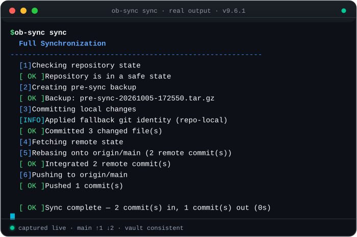
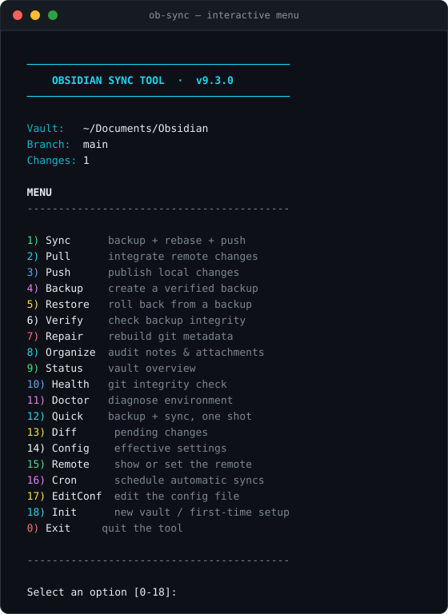
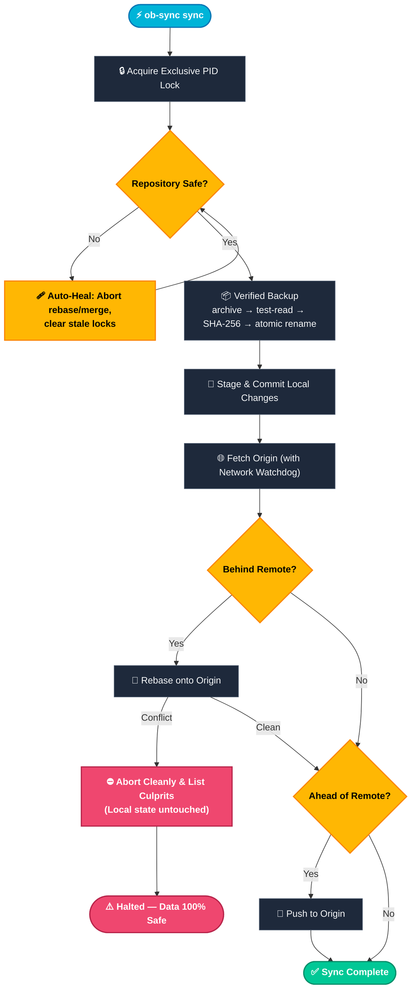
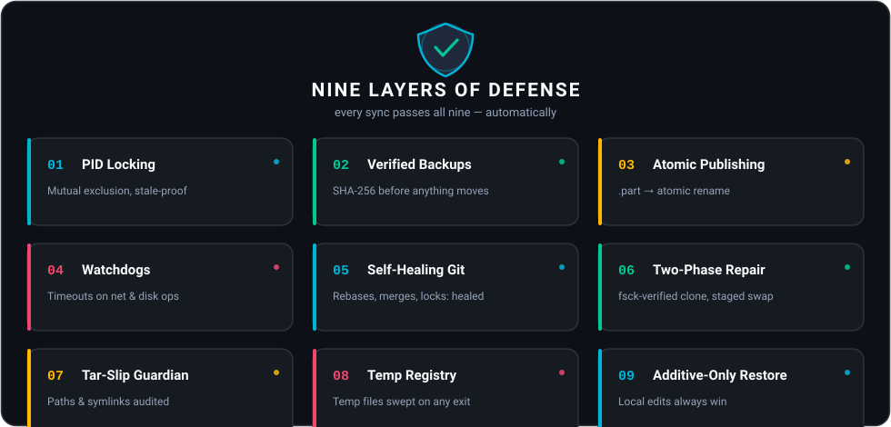

<div id="readme-top" align="center">

[English](README.md) | [فارسی](README.fa.md) | [Español](README.es.md)



**⚡ Enterprise-grade Obsidian ↔ GitHub sync — from your phone, your laptop, your anything.**

*One script. Three platforms. Zero extra dependencies. Nine layers of defense.*


[](CHANGELOG.md)
[](LICENSE)
[](#-quick-start)
[](https://www.gnu.org/software/bash/)
[](https://github.com/CheginiSoroush/obsidian-sync-scripts/actions/workflows/lint.yml)

<p align="center">
  <a href="#-quick-start">🚀 Quick Start</a> •
  <a href="#-the-interactive-menu">📱 Interactive TUI</a> •
  <a href="#️-command-reference">⌨️ CLI Reference</a> •
  <a href="#️-the-9-layers-of-defense">🛡️ 9-Layer Defense</a> •
  <a href="#-disaster-recovery-playbook">🚑 Recovery Playbook</a> •
  <a href="#-faq">❓ FAQ</a>
</p>

<p align="center">
  <a href="https://github.com/CheginiSoroush/obsidian-sync-scripts/stargazers"></a>
  <a href="https://github.com/CheginiSoroush/obsidian-sync-scripts/issues"></a>
  <a href="CONTRIBUTING.md"></a>
  <a href="https://cheginisoroush.github.io/obsidian-sync-scripts/"></a>
</p>

<p align="center">
  
</p>

<p align="center"><b>▲ Real output, animated.</b> A genuine captured <b>ob-sync sync</b> run — not a mockup.</p>

---

*“Your notes deserve better than hoping the sync works.”*

<details>
<summary>ASCII purists — the original logo lives here</summary>

<pre>
 ██████╗  ██████╗           ███████╗ ██╗   ██╗ ███╗   ██╗  ██████╗
██╔═══██╗ ██╔══██╗          ██╔════╝ ╚██╗ ██╔╝ ████╗  ██║ ██╔════╝
██║   ██║ ██████╔╝ ███████╗ ███████╗  ╚████╔╝  ██╔██╗ ██║ ██║
██║   ██║ ██╔══██╗ ╚══════╝ ╚════██║   ╚██╔╝   ██║╚██╗██║ ██║
╚██████╔╝ ██████╔╝          ███████║    ██║    ██║ ╚████║ ╚██████╗
 ╚═════╝  ╚═════╝           ╚══════╝    ╚═╝    ╚═╝  ╚═══╝  ╚═════╝
</pre>

</details>

</div>

<p align="center">
  
</p>

<br>

## 🔥 The Problem

You take notes on your phone and your laptop. You version them with Git.
Between those two facts lives a hellscape: mobile networks that die mid-push, Android killing background processes whenever it feels like it, shared storage with no `exec` bits — and one interrupted `git pull` away from a week of lost thoughts.

Most people give up and hope. **You don't have to.**

**`ob-sync`** is a single, self-contained Bash script that turns your terminal into a battle-hardened sync engine for your Obsidian vault — engineered specifically for the hostile environment of Android shared storage, and equally at home on Linux and macOS.

| 💀 Without `ob-sync` | 🛡️ With `ob-sync` |
| :--- | :--- |
| Interrupted `git pull` leaves your vault in rebase limbo | **Self-healing Git** aborts broken states & clears stale locks automatically |
| Network drops mid-push and hangs the terminal forever | **Watchdogs** enforce strict timeouts on every remote call *and* local bulk operation |
| Corrupted `.git` folder means manual surgery or lost notes | **Two-Phase Repair** atomically rebuilds metadata while preserving local files |
| No safety net before destructive Git operations | **SHA-256 Verified Backups** run before *any* mutation touches your vault |

> [!IMPORTANT]
> **Core Philosophy:** *No half-finished files. No silent data loss. No cryptic errors. Ever.*

---

## 🚀 Quick Start

### 📱 Android (Termux)

```bash
pkg install curl
curl -fsSL https://raw.githubusercontent.com/CheginiSoroush/obsidian-sync-scripts/main/mobile/install.sh | bash

ob-sync doctor     # 1. Verify the environment
ob-sync init       # 2. Clone or adopt your vault (asks for your GitHub repo URL)
ob-sync            # 3. Open the interactive menu
```

### 🖥️ Linux & macOS

```bash
git clone https://github.com/CheginiSoroush/obsidian-sync-scripts.git
cd obsidian-sync-scripts
./desktop/install.sh

ob-sync init && ob-sync sync   # init asks for your GitHub repo URL
```

> [!WARNING]
> Piping installers into `bash` is convenient but blind. If you prefer to inspect before executing, review [`mobile/install.sh`](mobile/install.sh) or [`desktop/install.sh`](desktop/install.sh) first, or use the `git clone` method above.

### ✨ What a Successful Sync Looks Like

▶️ **[Watch the animated real run](#readme-top)** — a genuine captured session plays at the top of this page. Exact output below:

```text
$ ob-sync sync

  Full Synchronization
  ────────────────────────────────────────────────────────
  [1] Checking repository state
  [ OK ] Repository is in a safe state
  [2] Creating pre-sync backup
  [ OK ] Backup: pre-sync-20250612-143207.tar.gz
  [3] Committing local changes
  [ OK ] Committed 3 changed file(s)
  [4] Fetching remote state
  [5] Rebasing onto origin/main (2 remote commit(s))
  [ OK ] Integrated 2 remote commit(s)
  [6] Pushing to origin/main
  [ OK ] Pushed 1 commit(s)

  [ OK ] Sync complete — 2 commit(s) in, 1 commit(s) out
```

---

## 📱 The Interactive Menu

Run `ob-sync` with no arguments. On a phone keyboard, typing subcommands is friction — **this menu is the whole point:**

<p align="center">
  
</p>

<details>
<summary>Same menu as plain text</summary>

```text
$ ob-sync

  ──────────────────────────────────────────
     OBSIDIAN SYNC TOOL  ·  v9.5.2
  ──────────────────────────────────────────

  Vault:   /storage/emulated/0/Documents/Obsidian
  Branch:  main
  Changes: 3
  Last:    2025-06-12 14:32:07

  MENU
  ------------------------------------------

  1) Sync      backup + rebase + push
  2) Pull      integrate remote changes
  3) Push      publish local changes
  4) Backup    create a verified backup
  5) Restore   roll back from a backup
  6) Verify    check backup integrity
  7) Repair    rebuild git metadata
  8) Organize  audit notes & attachments
  9) Status    vault overview
  10) Health   git integrity check
  11) Doctor   diagnose environment
  12) Quick    backup + sync, one shot
  13) Diff      pending changes
  14) Config    effective settings
  15) Remote    show or set the remote
  16) Cron      schedule automatic syncs
  17) EditConf  edit the config file
  18) Init      new vault / first-time setup
  0) Exit     quit the tool

  ------------------------------------------

  Select an option [0-18]:
```

</details>

> [!TIP]
> **Error-proof by design:** Operations never kill your interactive session, and the PID lock is cleanly released between actions — press `1` five times in a row if you like.

---

## 🧠 How It Works

<p align="center">
  
</p>

Every `ob-sync sync` execution walks through the same deterministic, fault-tolerant state machine — here it is, step by step:



---

## 🛡️ The 9 Layers of Defense

Between you and data loss stand nine independent walls — and the very first one is a timestamped, checksummed backup taken before *anything* else happens.

<p align="center">
  
</p>

| Layer | Mechanism | What It Guarantees |
| :---: | :--- | :--- |
| **01** | **PID Locking** | Two instances can never touch the vault simultaneously; dead PIDs are automatically reclaimed. |
| **02** | **Verified Backups** | An archive only counts if the full stream reads back cleanly *and* its SHA-256 checksum is recorded. |
| **03** | **Atomic Publishing** | Backups write to `.part` files and rename atomically — a crash never leaves a half-written archive. |
| **04** | **Watchdogs** | Every remote Git call (network watchdog) and every local bulk operation — archive, hash, `fsck` (local watchdog) — runs under a configurable timeout, so neither a hung connection nor a dead mount can freeze your vault. |
| **05** | **Self-Healing Git** | Interrupted rebases, unfinished merges, and stale `.lock` files are recovered automatically. |
| **06** | **Two-Phase Repair** | Replacement `.git` is cloned, `fsck`-verified, and staged *before* anything moves — with instant rollback. |
| **07** | **Tar-Slip Guardian** | `restore` audits every archive member prior to extraction — absolute paths, `..` traversal, and symlinks are refused. |
| **08** | **Temp Registry** | Every runtime temporary file is tracked and swept on *any* exit path — including `Ctrl+C`; artifacts leaked by an uncatchable `SIGKILL` are reclaimed on the next run. |
| **09** | **Additive-Only Restore** | Remote files are only ever *added* when missing during recovery; your local edits always win. |

---

## ⌨️ Command Reference

### 🔄 Synchronization & Workflow

| Command | Description |
| :--- | :--- |
| `ob-sync` | Launches the **Interactive Menu** (or runs a full sync when invoked non-interactively / via cron) |
| `ob-sync sync` | Full pipeline: `check` → `backup` → `commit` → `fetch` → `rebase` → `push` · add `--json` for a machine-readable result (see [Machine-Readable Operations](#machine-readable-operations)) |
| `ob-sync quick` | Creates one verified backup + runs full sync in a single shot · `--json` supported |
| `ob-sync pull` | Commits local changes, then integrates remote commits · `--json` supported |
| `ob-sync push` | Commits local changes, then publishes to remote · `--json` supported |
| `ob-sync cron [sub]` | Schedules automatic syncs in your crontab: `status` (default), `install <schedule> [HH:MM]`, `show`, `uninstall` — see [Scheduled Syncs](#-automation) |

### 📦 Backup, Restore & Repair

| Command | Description |
| :--- | :--- |
| `ob-sync backup` | Creates and SHA-256 verifies a full vault backup archive · add `--json` for a machine-readable result (see [Machine-Readable Backups](#machine-readable-backups)) |
| `ob-sync restore [--list \|--dry-run \|--json] [target]` | Rolls back from an audited backup (`latest`, filename, or path) · `--list` previews contents & checksum · `--dry-run` rehearses the full restore without changing anything · `--list --json` emits a machine-readable preview/inventory · `--json <target> -y` returns a machine-readable restore result for scripted DR drills (see [Machine-Readable Backups](#machine-readable-backups)) |
| `ob-sync verify [--json]` | Audits the cryptographic integrity of **every** stored backup — `--json` reports a per-archive result array (see [Machine-Readable Backups](#machine-readable-backups)) |
| `ob-sync repair` | Atomically rebuilds `.git` metadata from remote while preserving all local files |
| `ob-sync remote [url]` | Shows the remote URL — or sets a new one, persisted for cron shells too |

### 🩺 Diagnostics & Vault Hygiene

| Command | Description |
| :--- | :--- |
| `ob-sync organize [--fix]` | Audits empty notes, large files & orphaned attachments (`--fix` relocates orphans) · add `--json` for a machine-readable audit report — `--fix --json` returns the moved-files report (see [Machine-Readable Everything](#machine-readable-everything)) |
| `ob-sync diff` | Shows pending working-tree changes with human labels and a diff stat (read-only) |
| `ob-sync history [n]` | Lists the last `n` vault commits with relative dates (read-only) · add `--json` for a machine-readable commit document (see [Machine-Readable Everything](#machine-readable-everything)) |
| `ob-sync config` | Displays the effective configuration and where every value comes from (read-only) |
| `ob-sync doctor [--json]` | Diagnoses platform compatibility, required tools, storage permissions, remote & watchdog — warns when backups share a filesystem with the vault · `--json` emits a machine-readable checks report (see [Machine-Readable Diagnostics](#machine-readable-diagnostics)) |
| `ob-sync status [--json]` | Displays a clean overview of vault branch, pending changes, and sync state — `--json` emits machine-readable output for scripts & dashboards |
| `ob-sync health [--json]` | Runs a deep `git fsck` and repository integrity check — `--json` emits a per-stage checks report & statistics (see [Machine-Readable Diagnostics](#machine-readable-diagnostics)) |
| `ob-sync init` | Interactive first-time setup to clone a remote vault or adopt an existing folder |
| `ob-sync log [n]` | Shows recent sync and commit activity (defaults to last `n` entries) · add `--json` for a machine-readable activity document |
| `ob-sync edit-conf` | Opens the per-machine config file in `$EDITOR` (creates a commented starter template on first use) |

**Global Flags & Exit Codes:**

* **Flags:** `-y, --yes` (Auto-confirm) · `-n, --no-color` (Plain output) · `-h, --help` · `-v, --version`
* **Exit Codes:** `0` Success · `1` Operational Failure · `2` Lock Contention (Another instance is running)

---

## ⚙️ Configuration

Zero environment variables required — `ob-sync init` writes your choices to the per-machine config. Everything is still overridable:

| Variable | Default | Description |
| :--- | :--- | :--- |
| `OBS_VAULT` | `~/storage/shared/Documents/Obsidian` *(Termux)*<br>`~/Documents/Obsidian` *(Desktop)* | Path to your Obsidian vault |
| `OBS_CONFIG` | `~/.config/ob-sync/config` | Persistent per-machine config storing `VAULT`, `REMOTE` and `BRANCH` (written by `init` / `remote`); resolution: `OBS_VAULT` > config > auto-detection |
| `OBS_REMOTE` | *(unset — asked by `init`, settable via `remote <url>`)* | Git remote repository URL |
| `OBS_BRANCH` | `main` | Tracked Git branch |
| `OBS_BACKUP_DIR` | `~/obsidian-backups` | Directory where `.tar.gz` backups and checksums are stored |
| `OBS_KEEP_BACKUPS` | `10` | Number of rolling backups to retain (`0` = keep everything) |
| `OBS_LOG` | `~/ob-sync.log` | Log file path (set `""` to disable logging) |
| `OBS_GIT_TIMEOUT` | `120` | Network watchdog timeout in seconds (`0` disables) |
| `OBS_LOCAL_TIMEOUT` | `600` | Local watchdog timeout in seconds for tar archives, hashing and `fsck` (`0` disables) |
| `OBS_CRON_LOG` | `~/ob-sync-cron.log` | Output file for runs started by `ob-sync cron install` |
| `OBS_SKIP_BACKUP` | `0` | Set to `1` to skip the pre-sync safety backup |
| `OBS_ATTACH_DIR` | `Attachments` | Target folder when running `ob-sync organize --fix` |
| `OB_DISCOVER_ROOTS` | *(unset — `~/Documents`, `~/Obsidian`, `~/vaults` plus the mountpoints `/media`, `/run/media/<user>`, `/mnt`)* | Colon-separated override of the folders the vault switcher scans |

**Example — Fast Unattended Sync:**

```bash
OBS_SKIP_BACKUP=1 OBS_GIT_TIMEOUT=300 ob-sync sync
```

---

## 🚑 Disaster Recovery Playbook

When things go sideways, don't panic — run the matching command:

| Symptom / Scenario | Command to Run | What Happens |
| :--- | :--- | :--- |
| *"Repository not in a safe state"* | `ob-sync sync` | Auto-heals interrupted rebases/merges and clears dead locks |
| Sync keeps failing mysteriously | `ob-sync health` | Runs deep Git object & index diagnostics |
| `.git` directory is corrupted | `ob-sync repair` | Re-clones `.git` in staging, verifies it, and swaps it in safely |
| *"I want my notes from this morning"* | `ob-sync restore latest` | Verifies checksum & tar-slip safety, then restores your latest snapshot |
| *"What's inside that backup?"* | `ob-sync restore --list latest` | Verifies the archive, audits every member, and shows sizes, note counts and the top-level layout — without extracting |
| Suspect a damaged backup archive | `ob-sync verify` | Tests stream decompression & SHA-256 hashes across all backups |
| Something feels off in the environment | `ob-sync doctor` | Checks Bash version, coreutils, storage permissions, and SSH/PAT auth |
| **Total Catastrophe** | `tar -xzf <backup>.tar.gz` | Backups are standard `.tar.gz` archives — extract them anywhere, anytime |

📖 **Need deeper diagnostics?** Check out the full [Troubleshooting Guide](docs/TROUBLESHOOTING.md).

---

## 🤖 Automation

Exit codes are strict, documented, and stable. When invoked non-interactively (no TTY), plain `ob-sync` **automatically defaults to a full sync** — drop it into any scheduler and it just works.

### Scheduled Syncs (`cron`)

Turn on automatic syncing with one command — no hand-editing of crontabs:

```bash
ob-sync cron install hourly               # presets: 15min · 30min · hourly · daily [HH:MM]
ob-sync cron install daily 09:30          # every morning at 09:30
ob-sync cron install "*/5 9-18 * * 1-5"   # or any raw 5-field cron expression
ob-sync cron status                       # show the scheduled job
ob-sync cron uninstall                    # remove it (asks; add -y in scripts)
```

`cron install` writes a **marker-delimited block** into your user crontab — installing again updates it in place, your other cron entries are never touched. The job pins the absolute `ob-sync` path and your current `PATH` (a cron environment inherits neither), appends output to `~/ob-sync-cron.log` for debugging, and warns up front if no remote or vault is configured yet.

> [!TIP]
> **Termux needs a cron daemon first:** `pkg install cronie termux-services && sv-enable crond`.

<details>
<summary>Prefer a hand-written crontab?</summary>

That still works — plain `ob-sync` detects non-interactive shells and runs a full sync:

```bash
*/30 * * * * ob-sync sync >> ~/ob-sync-cron.log 2>&1
```

</details>

### Machine-Readable Everything

The machine surface at a glance — **fourteen documents across thirteen commands**. Every `--json` command guarantees the same three things: the document is the **only** thing on stdout, human diagnostics go to stderr, and the exit code always matches the human command:

| Command | Document highlights | Failure contract |
| :--- | :--- | :--- |
| `status --json` | platform, vault, git, backups, watchdogs, cron, config, `last_sync` | never fails (rc 0) |
| `sync --json` · `pull --json` · `push --json` · `quick --json` | one shared shape: result, branch, remote, pulled/pushed/committed/conflicts, backup, elapsed | `{ "result": "error", "error": { "code", "message" } }`, rc 1 |
| `backup --json` | backup name, path, exact size, sidecar state | `backup: null` + error, rc 1 |
| `restore --list --json` | whole-directory inventory or per-archive preview | `{ "error": … }`, rc 1 |
| `restore --json <target> -y` | apply result: archive, `safety_backup`, `previous_vault`, elapsed | stable error code, rc 1; rc 2 when the lock is busy |
| `verify --json` | per-archive rows + `total` / `passed` / `failed` | `verification_failed`, rc 1 |
| `health --json` | seven checks rows + statistics block | `health_issues` / `health_failed`, rc 1 |
| `doctor --json` | checks array (`ok`/`warn`/`fail`/`info`) | `result: "error"` when any check failed, rc 1 |
| `log --json [n]` | `entries[{timestamp, source, message}]` | `log_unreadable` rc 1; a missing log is valid empty data, rc 0 |
| `history --json [n]` | `commits[{hash, date, author, subject}]` — full SHA-1, ISO 8601 dates | `history_unreadable` rc 1; a fresh repo is valid empty data, rc 0 |
| `organize --json [--fix]` | vault audit: scan counts, untitled/empty/oversized (exact bytes), orphans; with `--fix`: `moved[{from, to}]`, `skipped[{file, reason}]` | `scan_failed` / `attach_dir_create_failed` rc 1; scan never takes the lock, fix answers `lock_busy` rc 2 |

The full error-code table (with first-aid for each) lives in the [Troubleshooting Guide](docs/TROUBLESHOOTING.md#machine-readable-modes---json).

`log --json` turns ob-sync's own activity log into data — one row per entry with `timestamp`, `source` (the emitting function) and `message`, so automation can watch a cron fleet with `jq` instead of parsing free text. A missing or disabled log file is valid empty data (`log_file: null`, rc 0); rc 1 is reserved for an existing-but-unreadable file:

```console
$ ob-sync log --json 3
{
  "version": "9.5.2",
  "command": "log",
  "log_file": "~/ob-sync.log",
  "requested": 3,
  "count": 3,
  "entries": [
    { "timestamp": "2025-06-12 14:32:07", "source": "main", "message": "invoked: sync" },
    { "timestamp": "2025-06-12 14:32:08", "source": "make_backup", "message": "Backup created: pre-sync-20250612-143208.tar.gz (tar rc=0)" },
    { "timestamp": "2025-06-12 14:32:10", "source": "sync_run", "message": "Sync OK — pulled=2 pushed=1" }
  ],
  "error": null
}

$ ob-sync log --json 50 | jq -r '.entries[] | select(.message | test("ERROR")) | .timestamp'   # recent failures
```

`history --json` turns the vault's commit history into data — one row per commit with the **full SHA-1 hash** (unambiguous; shorten with `jq` if you like), an **ISO 8601 strict date** (stable and sortable, unlike the human view's relative "2 hours ago"), the author and the subject. A fresh repository with no commits yet is valid empty data (`count: 0`, rc 0); rc 1 is reserved for a repository that cannot be read at all:

```console
$ ob-sync history --json 2
{
  "version": "9.5.2",
  "command": "history",
  "requested": 2,
  "count": 2,
  "commits": [
    { "hash": "8f2a1c4b7e93d0a6f5c21804bb7d1e2f9a4c5d60", "date": "2025-06-12T14:32:10+02:00", "author": "Soroush", "subject": "sync: automated snapshot" },
    { "hash": "3b9d0e7a1f46c2859d0b3e7f4a1c5d8e2b6f9071", "date": "2025-06-12T09:14:55+02:00", "author": "Soroush", "subject": "sync: automated snapshot" }
  ],
  "error": null
}

$ ob-sync history --json 50 | jq -r '[.commits[].date] | min'   # when was the vault born?
```

`organize --json` is the vault audit as a document: scan counters, the untitled / empty / oversized lists (with exact byte sizes) and the orphan list. In `--fix` mode it becomes a **moved-files report** — every file landing in the attachments folder is recorded in `moved`, and anything that could not move (name collision, already in place) is recorded in `skipped` with a reason — so a scripted cleanup can verify its own outcome instead of trusting a summary line:

```console
$ ob-sync organize --fix --json
{
  "version": "9.5.2",
  "command": "organize",
  "mode": "fix",
  "result": "ok",
  "vault": "~/Documents/Obsidian",
  "attach_dir": "Attachments",
  "scan": { "notes": 214, "attachments": 96, "other": 3 },
  "untitled": [ ],
  "empty_notes": [ ],
  "oversized": [ ],
  "orphans": [ "Attachments/stray.png", "loose.png" ],
  "moved": [ { "from": "loose.png", "to": "Attachments/loose.png" } ],
  "skipped": [ { "file": "Attachments/stray.png", "reason": "already in attachments dir" } ],
  "elapsed_seconds": 0,
  "error": null
}

$ ob-sync organize --fix --json | jq -r '.moved[].to'   # what just moved?
```

### Machine-Readable Status

`status --json` prints a stable, JSON-escaped document (booleans are real booleans, missing values are `null`) — perfect for dashboards, Tasker scripts, or monitoring. The JSON document is the **only** thing on stdout: user-facing notices like vault auto-detection are suppressed (and logged instead), so parsers never see garbage:

```console
$ ob-sync status --json
{
  "version": "9.5.2",
  "platform": "linux",
  "vault":  { "path": "~/Documents/Obsidian", "exists": true, "notes": 412, "size_bytes": 28411596 },
  "git":    { "installed": true, "initialized": true, "branch": "main",
              "remote": "git@github.com:you/vault.git", "changes": 3,
              "last_commit": { "hash": "a1b2c3d", "subject": "chore(sync)", "date": "2 hours ago" },
              "ahead": 1, "behind": 0 },
  "backups":  { "total": 10, "retention": 10, "directory": "~/obsidian-backups" },
  "watchdogs": { "network_seconds": 120, "local_seconds": 600 },
  "cron":     { "available": true, "scheduled": true,
                "job": "0 * * * * \"~/bin/ob-sync\" sync >> \"~/ob-sync-cron.log\" 2>&1",
                "log": "~/ob-sync-cron.log" },
  "config":   { "file": "~/.config/ob-sync/config", "exists": true, "vault_source": "config file" },
  "last_sync": "2025-06-12 14:32:07"
}

$ ob-sync status --json | jq -r '.git.changes'   # → 3
$ ob-sync status --json | jq -r '.cron.scheduled' # → true
```

The `config.vault_source` field answers the classic "*why is it syncing THAT folder?*" — it reports exactly how the vault was resolved: `environment`, `config file`, `auto-detected`, `selected`, or `default`.

### Machine-Readable Operations

All four data operations — `sync`, `pull`, `push` and `quick` — accept `--json` and emit **one stable, shared document shape** on stdout, so a single parser covers every automation hook, cron wrapper and CI job. The pipeline is byte-for-byte the same as human mode (backup, commit, fetch, rebase, push), the exit-code contract is unchanged (`0` = success, `1` = failed), and failures are data, not log-scraping: every failure carries a stable machine `code`, and stdout stays parseable even when the environment itself is broken (missing git, missing vault, unreachable remote):

```console
$ ob-sync sync --json
{
  "version": "9.5.2",
  "command": "sync",
  "result": "ok",
  "branch": "main",
  "remote": "git@github.com:you/vault.git",
  "pulled": 2,
  "pushed": 1,
  "committed_files": 3,
  "conflicts": 0,
  "backup": "pre-sync-20250612-140001.tar.gz",
  "backup_skipped": false,
  "elapsed_seconds": 4,
  "error": null
}

$ ob-sync sync --json; echo "rc=$?"          # a failed sync, as data:
{
  "result": "error",
  ...
  "error": { "code": "conflict", "message": "Merge conflict — local commits are preserved" }
}
rc=1
```

The same document comes back from `pull --json`, `push --json` and `quick --json` with the `command` field set accordingly (`pull` always reports `pushed: 0`, `push` always `pulled: 0`). `quick` reports its own verified backup as the operation's `backup` — what scripts see matches what landed on disk, even when the sync part then fails:

```console
$ ob-sync quick --json | jq -r '.command, .backup'
quick
quick-20250612-140001.tar.gz
```

The full error-code table (with first-aid for each) and a ready-made cron wrapper live in the [Troubleshooting Guide](docs/TROUBLESHOOTING.md#machine-readable-modes---json). Progress UI is demoted to the log file and human errors to stderr, so `ob-sync sync --json 2>>sync.err` gives you a parseable result and an audit trail in one line.

### Machine-Readable Backups

`restore --list --json` runs the same verified preview pipeline (stream check, sidecar checksum, tar-slip member audit) but renders JSON — a backup inventory for monitoring, or a per-archive preview before scripted restores. Failures are parseable too: a corrupt archive returns `{ "error": ... }` with exit code `1`:

```console
$ ob-sync restore --list --json                  # whole backup directory, newest first
{
  "directory": "~/obsidian-backups",
  "count": 2,
  "backups": [
    { "name": "pre-sync-20250612-140001.tar.gz", "path": "~/obsidian-backups/pre-sync-20250612-140001.tar.gz",
      "size_bytes": 28311552, "timestamp": "20250612-140001", "mtime": 1749734401,
      "sidecar": true, "sidecar_ok": true },
    { "name": "manual-20250612-091530.tar.gz", "path": "~/obsidian-backups/manual-20250612-091530.tar.gz",
      "size_bytes": 28298240, "timestamp": "20250612-091530", "mtime": 1749717330,
      "sidecar": true, "sidecar_ok": true }
  ]
}

$ ob-sync restore --list --json latest | jq -r '.notes'   # → 412 markdown notes in the archive
```

`sidecar_ok` is `null` when an archive has no checksum sidecar yet — otherwise it is the real SHA-256 verification result. An empty backup directory is valid data (`"count": 0`, exit `0`), so schedulers and dashboards never need special-casing.

`backup --json` completes the picture: a manual snapshot reports exactly what landed on disk — name, path, exact size, and the sidecar verification result — so a scripted backup can check its own output instead of scraping terminal text. Exit codes are unchanged (`0` = created, `1` = failed), failures carry a stable machine code (`backup_failed`, `vault_missing`, `lock_busy`) and `backup: null`:

```console
$ ob-sync backup --json
{
  "version": "9.5.2",
  "command": "backup",
  "result": "ok",
  "backup": { "name": "manual-20250612-140001.tar.gz", "path": "~/obsidian-backups/manual-20250612-140001.tar.gz",
              "size_bytes": 28411596, "sidecar": true, "sidecar_ok": true },
  "elapsed_seconds": 2,
  "error": null
}

$ ob-sync backup --json | jq -e '.backup.sidecar_ok'   # fail the script if the checksum is broken
true
```

`verify --json` closes the loop: a scheduled audit gets one row per stored archive — `status` of `ok` / `corrupt`, exact `size_bytes`, and the sidecar state — next to `total` / `passed` / `failed` counters, so an alert can name the exact damaged archive instead of just "verification failed". Like `backup --json`, a missing sidecar is **not** a failure (`sidecar_ok` is `null`); the exit code mirrors the human command (`0` all verified or nothing to verify, `1` any corrupt archive, machine code `verification_failed`). And because verify is read-only and never takes the lock, it is safe to run **while a sync is in progress**:

```console
$ ob-sync verify --json
{
  "version": "9.5.2",
  "command": "verify",
  "result": "ok",
  "backup_dir": "~/obsidian-backups",
  "total": 2,
  "passed": 2,
  "failed": 0,
  "archives": [
    { "name": "manual-20250612-140001.tar.gz", "status": "ok", "size_bytes": 28411596, "sidecar": true, "sidecar_ok": true },
    { "name": "pre-sync-20250612-133000.tar.gz", "status": "ok", "size_bytes": 28398210, "sidecar": true, "sidecar_ok": true }
  ],
  "elapsed_seconds": 1,
  "error": null
}

$ ob-sync verify --json | jq -r '.archives[] | select(.status == "corrupt") | .name'   # → the damaged archive, by name
```

`restore --json <target> -y` completes the backup story end-to-end: a scripted DR drill returns ONE result document — which archive was restored (name, path, size, sidecar verification), the automatic `safety_backup` of the replaced vault, where the `previous_vault` was preserved, and the elapsed time — so a drill can assert its own success instead of scraping terminal text. JSON mode never prompts: an explicit target and `-y` are required, every refusal (no consent, unknown target, corrupt archive, checksum mismatch, tar-slip member, lock contention) carries a stable machine code, and even a failed run reports exactly which archive it was about to restore:

```console
$ ob-sync restore --json latest -y
{
  "version": "9.5.2",
  "command": "restore",
  "mode": "apply",
  "result": "ok",
  "target": "latest",
  "vault": "~/Documents/Obsidian",
  "archive": { "name": "pre-sync-20250612-140001.tar.gz", "path": "~/obsidian-backups/pre-sync-20250612-140001.tar.gz",
               "size_bytes": 28311552, "sidecar": true, "sidecar_ok": true },
  "safety_backup": "pre-restore-20250612-153000.tar.gz",
  "previous_vault": "~/Documents/Obsidian.pre-restore-20250612-153000",
  "elapsed_seconds": 2,
  "error": null
}

$ ob-sync restore --json latest -y | jq -e '.result == "ok" and .archive.sidecar_ok'   # DR drill gate
true
```

### Machine-Readable Diagnostics

`doctor --json` turns the full diagnostic report into a machine-readable checks array — one row per check, each with a stable `name`, a `status` of `ok` / `warn` / `fail` / `info`, and a human-readable `message`. The top-level `result` is `"error"` (and the exit code `1`) **iff any check failed**; warnings keep exit code `0`, exactly like the human report. Setup scripts and dashboards parse health instead of guessing from exit codes:

```console
$ ob-sync doctor --json
{
  "version": "9.5.2",
  "command": "doctor",
  "result": "ok",
  "platform": "termux",
  "remote": "git@github.com:you/vault.git",
  "default_branch": "main",
  "checks": [
    { "name": "platform",        "status": "ok",   "message": "Termux 0.118 (Android)" },
    { "name": "tools",           "status": "ok",   "message": "All required tools are available" },
    { "name": "storage",         "status": "ok",   "message": "Shared storage is mounted" },
    { "name": "vault",           "status": "ok",   "message": "Vault found and writable (source: config file)" },
    { "name": "backup_dir",      "status": "ok",   "message": "Backup directory is ready (...)" },
    { "name": "backup_topology", "status": "warn", "message": "Backups share a filesystem with the vault (...)" },
    { "name": "remote",          "status": "ok",   "message": "Remote is reachable" },
    { "name": "remote_branch",   "status": "ok",   "message": "Remote default branch 'main' matches configuration" },
    { "name": "watchdogs",       "status": "ok",   "message": "Network watchdog active (120s) · local watchdog active (600s)" },
    { "name": "free_space",      "status": "info", "message": "Free space ($HOME): 15G" }
  ],
  "error": null
}

$ ob-sync doctor --json | jq -r '.checks[] | select(.status == "warn" or .status == "fail") | .name'
backup_topology
```

`doctor --json` is strictly **read-only** — unlike the human report it never creates the backup directory, so it is safe to run from monitoring jobs. A missing vault degrades to a `warn` row (exit stays `0`); an unwritable vault or a missing Termux storage permission is a `fail` row with `result: "error"` and exit `1`.

`health --json` is the repository-integrity counterpart: the deep `git fsck` check becomes a checks array too — always the **same seven rows** (`git`, `repository`, `head`, `object_database`, `safe_state`, `remote`, `identity`), with stages skipped by an earlier failure reported as `info` "Not checked" rows so dashboards can index them positionally. A `statistics` block carries the same numbers the human report prints (commits, tracked files, `.git` size, free space — byte-exact, `null` when unknown). The exit code mirrors the human contract: warnings (missing remote or identity, an unsafe state) already fail automation with `result: "error"` + machine code `health_issues`, while a hard failure carries `health_failed`:

```console
$ ob-sync health --json
{
  "version": "9.5.2",
  "command": "health",
  "result": "ok",
  "branch": "main",
  "vault": "~/Documents/Obsidian",
  "checks": [
    { "name": "git",             "status": "ok", "message": "git is available" },
    { "name": "repository",      "status": "ok", "message": "Repository exists" },
    { "name": "head",            "status": "ok", "message": "HEAD is valid" },
    { "name": "object_database", "status": "ok", "message": "Object database is intact" },
    { "name": "safe_state",      "status": "ok", "message": "Repository is in a safe state" },
    { "name": "remote",          "status": "ok", "message": "Remote 'origin' is configured" },
    { "name": "identity",        "status": "ok", "message": "Git identity is configured" }
  ],
  "statistics": { "commits": 214, "tracked_files": 431, "git_size_bytes": 10485760, "free_space_bytes": 16106127360 },
  "error": null
}

$ ob-sync health --json | jq -r '.checks[] | select(.status == "warn" or .status == "fail") | .name'
remote
```

Both commands are read-only and lock-free — `verify --json` and `health --json` never take the PID lock, so a monitoring job can audit a vault mid-sync without ever blocking (or being blocked by) a running sync.

### Shell Completion

Tab-complete every command and flag:

**Bash** (ships in [`completions/ob-sync.bash`](completions/ob-sync.bash)):

```bash
# one-time, per-user
mkdir -p ~/.local/share/bash-completion/completions
cp completions/ob-sync.bash ~/.local/share/bash-completion/completions/ob-sync
exec bash   # reload
```

**zsh** (ships in [`completions/_ob-sync`](completions/_ob-sync)):

```bash
# one-time, per-user (fpath must include the directory BEFORE compinit)
mkdir -p ~/.zsh/completions
cp completions/_ob-sync ~/.zsh/completions/
echo 'fpath=(~/.zsh/completions $fpath)' >> ~/.zshrc
exec zsh    # reload
```

> [!TIP]
> **oh-my-zsh users:** drop the file into `~/.oh-my-zsh/completions/` — that directory is already on your `fpath`. Termux users: `pkg install zsh-completions` and use the `fpath` approach above.

---

## 🗂️ Repository Architecture

```text
obsidian-sync-scripts/
├── bin/
│   └── ob-sync               # The entire engine: one platform-aware Bash script
├── mobile/
│   └── install.sh            # Termux environment setup & installer
├── desktop/
│   └── install.sh            # Linux / macOS installer
├── completions/
│   ├── ob-sync.bash          # Bash tab-completion for every command & flag
│   └── _ob-sync              # zsh tab-completion for every command & flag
├── tests/
│   └── run-tests.sh          # Functional test suite — 330 assertions, no network needed
├── docs/
│   ├── TROUBLESHOOTING.md    # Symptom index + deep-dive recovery guides
│   └── menu.svg              # Real terminal capture of the interactive TUI
└── .github/
    └── workflows/            # CI: ShellCheck + tests + markdownlint · Releases: automated on tag push
```

**One Core, Three Platforms:** The script detects Termux, Linux, or macOS at runtime and adapts defaults, filesystem checks, and recovery hints automatically. Platform quirks (BSD vs. GNU userland) are isolated behind clean portability helpers — never split into messy forks.

---

## 🧪 Testing

The repository carries its own functional test suite. It builds a throwaway sandbox (local bare remote, two simulated devices, isolated `$HOME`, an emulated `crontab`), then drives the real script through sync, conflict, corruption, backup, restore, lock, cron and config-editing scenarios — **no network access and no root required**:

```bash
bash tests/run-tests.sh     # PASS=330 FAIL=0 → exit code 0
```

CI runs ShellCheck (pinned v0.11.0), the full test suite, and markdownlint on every push and pull request.

---

## ❓ FAQ

<details>
<summary><b>🔒 Is my data actually safe?</b></summary>
<br>

Yes. Every mutating operation starts with a **verified backup** — test-read and SHA-256 checksummed — before anything else happens. File operations use atomic `.part` renames. Restores audit every archive member before extraction. The architecture assumes failure will happen and plans around it.
</details>

<details>
<summary><b>🔑 How do I sync a private GitHub repository?</b></summary>
<br>

Configure Git's credential store and authenticate once with your Personal Access Token (PAT):

```bash
git config --global credential.helper store
git ls-remote https://github.com/you/private-vault.git   # Enter your PAT once
```

`ob-sync doctor` will print this exact hint if it detects an unreachable remote.
</details>

<details>
<summary><b>📱 What happens if Android kills Termux mid-sync?</b></summary>
<br>

That is the exact scenario `ob-sync` was built for:

1. On the next run, the PID lock detects the dead process ID and reclaims itself.
2. Any half-written backup exists only as a `.part` file and is automatically swept.
3. Any interrupted rebase or merge is cleanly auto-aborted before syncing resumes.

</details>

<details>
<summary><b>🍎 What are the macOS requirements?</b></summary>
<br>

Run `brew install bash coreutils` to cover the two macOS gaps (Bash 4+ and the `timeout` watchdog utility). Everything else — SHA-256 hashing via `shasum`, portable file sizes, and BSD flags — is handled automatically.
</details>

<details>
<summary><b>🧩 Why not just use the community Obsidian Git plugin?</b></summary>
<br>

You absolutely can — and they coexist peacefully on the same vault! `ob-sync` exists for when you want:

* Background or cron syncs (`ob-sync cron install hourly`) **without opening Obsidian**
* Hardened resilience on **Android shared storage**
* Cryptographically **verified `.tar.gz` backups** outside Git history
* An atomic **`.git` repair tool** when mobile crashes corrupt your repo

</details>

---

## 🤝 Contributing & License

Contributions, bug reports, and edge-case battle stories are welcome! Please read [CONTRIBUTING.md](CONTRIBUTING.md) first — our ShellCheck CI gate and strict portability rules keep this codebase boring in the best possible way.

Released under the **[MIT License](LICENSE)**.

<br>

<div align="center">

---

<p align="center">
  
</p>

**Made with 🖤 for everyone whose best ideas arrive far from a keyboard.**

⭐ **If `ob-sync` saved your vault, a star on GitHub is the best thank-you there is.** ⭐

<br>

[⬆️ Back to Top](#readme-top)

</div>
